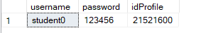
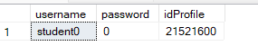
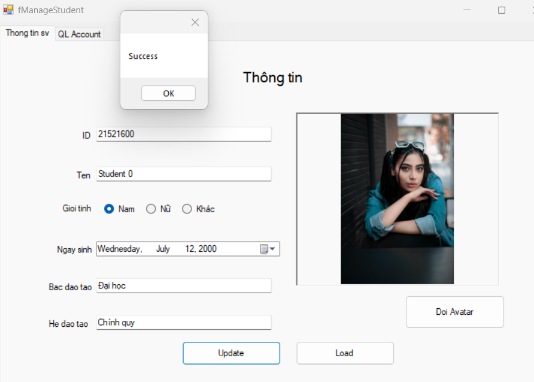
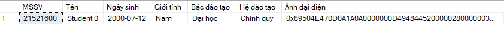
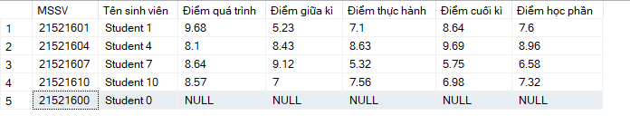
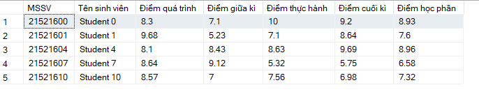
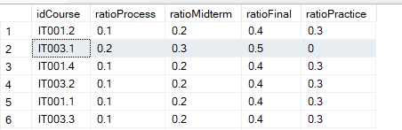

# Database with SQL server

## Cách dùng

B1. Ctrl + A

B2. F5 (Execute query)

=> Để nạp database vào DB, sau này sẽ nạp bằng giao diện hoặc import từ file

## Diagram


## Store Procedure

### Login Proc

```
Login (username, password)
    if (success)
        return MSSV

```

_Example:_

```SQL
EXEC Login @username = N'student1' , @password = N'123456'
```


### LoadProfileById

Load thông tin của user

```SQL
EXEC LoadProfileById @id = N'21521601'
```


### GetScheduleByID

Get thời khóa biểu của user

-   Gồm sinh viên or giảng viên
-   Gồm các môn đã đăng kí học (được phân công giảng dạy)

```SQL
EXEC GetScheduleByID @id = N'21521601'
```


### GetListRegisterCourse

Get danh sách tất cả môn học để đăng kí học phần

```SQL
EXEC GetListRegisterCourse
```


### GetLearningOutcomes

Get kết quả học tập của sinh viên

```SQL
EXEC GetLearningOutcomes @id = N'21521601'
```


### GetClassInCharge

Get danh sách lớp đang giảng dạy của giáo viên

```SQL
EXEC GetClassInCharge @id = N'GV2'
```


### GetListClass

Get danh sách sinh viên của một lớp

```SQL
EXEC GetListClass @idCourse = N'IT003.1'
```


## CRUD

### InsertAcc

Tạo account cho sinh viên có [MSSV]

```
InsertAcc(username, password, id)
    if exist (username or id) return

    insert [username, password] to Account
    insert [id] to Profile
    insert [username, id] to UserAcc

```

```SQL
EXEC InsertAcc  @username = N'student0',
                @password = N'123456',
                @id = N'21521600'
```



### UpdatePass

```SQL
EXEC UpdatePass @username = N'student0',
                @password = N'0'
```



### UpdateProfile

_UI_



_Database_



### JoinCourse

```SQL
EXEC JoinCourse @idProfile = N'21521600',
                @idCourse = N'IT003.1'
```



### LeaveCourse

Hủy môn học đã đăng kí

```SQL
EXEC LeaveCourse    @idProfile = N'21521600',
                    @idCourse = N'IT003.1'
```


### UpdateScore

```SQL
EXEC UpdateScore    @idCourse = N'IT003.1',
                    @idProfile = N'21521600',
                    @processScore = 8.3,
                    @midtermScore = 7.1,
                    @finalScore = 9.2,
                    @practiceScore = 10
```



### UpdateRatioScore

Cập nhật tỉ lệ điểm các phần (_điểm quá trình **0.2**, điểm giữa kì **0.3**,..._)

```SQL
EXEC UpdateRatioScore @idCourse = N'IT003.1',
                @ratioProcess = 0.2,
                @ratioMidterm = 0.3,
                @ratioFinal = 0.5,
                @ratioPractice = 0
```



## Note

### Save image to DB

Để lưu hình ảnh vào Database ta cần convert `image` to `byte[]`

```cs
public byte[] ConvertImageToBytes(Image img)
{
    if (img == null) { return null; }

    using (MemoryStream ms = new MemoryStream())
    {
        img.Save(ms, ImageFormat.Png);
        return ms.ToArray();
    }
}
```

### Load image from DB

Để load ảnh từ Database để hiển thị ta làm ngược lại

```cs
    public Image ConvertBytesToImage(byte[] data)
    {
        using (MemoryStream ms = new MemoryStream(data))
        {
            return Image.FromStream(ms);
        }
    }
```

### Hash password

Dùng thuật toán [Bcrypt](https://www.nuget.org/packages/BCrypt.Net-Next/4.0.3?_src=template) để hash password

`workFactor >= 12` để đảm bảo mật khẩu khó bị bruteforce

Cần cài đặt BCrypt.Net trước

[link Bcrypt](https://www.nuget.org/packages/BCrypt.Net-Next/4.0.3?_src=template)

**Hash password**

```cs

string HashedPassword(string password)
{
    return BCrypt.Net.BCrypt.EnhancedHashPassword(password, 12);
}

```

**Verify password**

```cs
bool VerifyPassword(string password, string hashedPassword)
{
    return BCrypt.Net.BCrypt.EnhancedVerify(password, hashedPassword);
}

```
