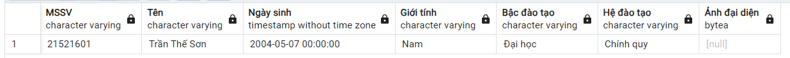
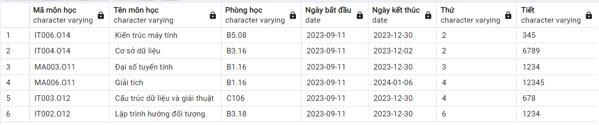
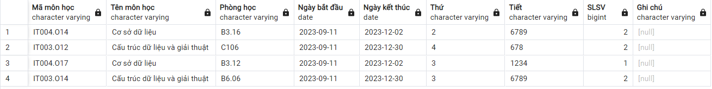
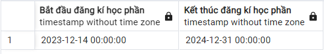

# Database

## Static data

-   Các data từ dòng 1 -> 723 là data có sẵn trong hệ thống nên cần được chèn vào


-   Các data sau dòng 729 là các data được thêm vào khi người dùng tương tác với hệ thống

## Diagram


## Store Procedure

### Login Proc

-   Input: username

-   Output: id, password, role

_Note: password trả về đã được **mã hóa** với Bcrypt_

```SQL
CREATE OR REPLACE FUNCTION "Login"(_username VARCHAR(100))
RETURNS TABLE("id" VARCHAR(100), "password" VARCHAR(1000), "role" VARCHAR(100)) AS $$
BEGIN
    RETURN QUERY
    SELECT Profile.id as "MSSV" ,  Account.password as "Password", Account.role as "Role"
    FROM Account, Profile, UserAcc
    WHERE   Account.username = UserAcc.idAccount AND
            UserAcc.idProfile = Profile.id AND
            username = _username;
END;
$$ LANGUAGE plpgsql;


```

_Example:_

```SQL
SELECT * FROM "Login"('student1');
```


### LoadProfileById

Load thông tin của user

```SQL
CREATE OR REPLACE FUNCTION LoadProfileById(_id VARCHAR(100))
RETURNS TABLE("MSSV" VARCHAR(100), "Tên" VARCHAR(100), "Ngày sinh" TIMESTAMP, "Giới tính" VARCHAR(100), "Bậc đào tạo" VARCHAR(100), "Hệ đào tạo" VARCHAR(100), "Ảnh đại diện" BYTEA) AS $$
BEGIN
    RETURN QUERY
    SELECT id as "MSSV",
           name as "Tên",
           birthday as "Ngày sinh",
           gender as "Giới tính",
           level as "Bậc đào tạo",
           trainingSystem as "Hệ đào tạo",
           avatar as "Ảnh đại diện"
    FROM Profile
    WHERE id = _id;
END;
$$ LANGUAGE plpgsql;
```

_Example:_

```SQL
SELECT * FROM LoadProfileById('21521601');
```



### GetScheduleByID

Lấy thời khóa biểu của user

```SQL
CREATE OR REPLACE FUNCTION GetScheduleByID(_id VARCHAR(100))
RETURNS TABLE("Mã môn học" VARCHAR(100), "Tên môn học" VARCHAR(100), "Phòng học" VARCHAR(100), "Ngày bắt đầu" DATE, "Ngày kết thúc" DATE, "Thứ" VARCHAR(100), "Tiết" VARCHAR(100)) AS $$
BEGIN
    RETURN QUERY
    SELECT Course.id as "Mã môn học",
           Course.name as "Tên môn học",
           Course.classroom as "Phòng học",
           Course.startDay as "Ngày bắt đầu",
           Course.endDay as "Ngày kết thúc",
           Course.schoolDay as "Thứ",
           Course.lesson as "Tiết"
    FROM Schedule, Course
    WHERE Schedule.idProfile = _id
        AND Schedule.idCourse = Course.id

    -- Sắp xếp tăng dần để vẽ thời khóa biểu

	ORDER BY Course.schoolDay ASC,
            Course.lesson ASC;
END;
$$ LANGUAGE plpgsql;
```

_Example:_

```SQL
select * from GetScheduleByID('21521601')
```



### GetListRegisterCourse

Lấy danh sách tất cả môn học để đăng kí học phần

_Note: Nếu quá hạn đăng kí, sẽ không load được danh sách_

```SQL
CREATE OR REPLACE FUNCTION GetListRegisterCourse()
RETURNS TABLE(
	"Mã lớp" VARCHAR(100),
    "Tên môn học" VARCHAR(100),
    "Mã giảng viên" VARCHAR(100),
    "Tên giảng viên" VARCHAR(100),
    "Số tín chỉ" INT,
    "Thứ" VARCHAR(100),
    "Tiết" VARCHAR(100),
    "Phòng" VARCHAR(100),
    "Học kì" VARCHAR(100),
    "Năm học" VARCHAR(100),
    "Ngày bắt đầu" DATE,
    "Ngày kết thúc" DATE
) AS $$
BEGIN

    -- Nếu quá thời hạn đăng kí học phần sẽ không load được kết quả
    IF CURRENT_TIMESTAMP > (SELECT endTime FROM RegistrationPeriod ORDER BY id DESC LIMIT 1) THEN
        RETURN;
    ELSE
        RETURN QUERY
        SELECT Course.id as "Mã lớp",
			   Course.name as "Tên môn học",
               Profile.id as "Mã giảng viên",
               Profile.name as "Tên giảng viên",
               Course.numberOfCredits as "Số tín chỉ",
               Course.schoolDay as "Thứ",
               Course.lesson as "Tiết",
               Course.classroom as "Phòng",
               Course.semester as "Học kì",
               Course.schoolYear as "Năm học",
               Course.startDay as "Ngày bắt đầu",
               Course.endDay as "Ngày kết thúc"
        FROM Schedule
        JOIN Course ON Schedule.idCourse = Course.id
        JOIN Profile ON Schedule.idProfile = Profile.id
        JOIN UserAcc ON Profile.id = UserAcc.idProfile
        JOIN Account ON UserAcc.idAccount = Account.username
        WHERE Account.role = 'teacher'
        ORDER BY Course.name, Course.id;
    END IF;
END;
$$ LANGUAGE plpgsql;

```

_Example:_

```SQL
SELECT * FROM GetListRegisterCourse();
```


### GetLearningOutcomes

Load kết quả học tập của sinh viên

```SQL
CREATE OR REPLACE FUNCTION GetLearningOutcomes(_id VARCHAR(100))
RETURNS TABLE("Mã học phần" VARCHAR(100), "Tên học phần" VARCHAR(100), "Tín chỉ" INT, "Điểm quá trình" FLOAT, "Điểm giữa kì" FLOAT, "Điểm thực hành" FLOAT, "Điểm cuối kì" FLOAT, "Điểm học phần" FLOAT, "Học kì" VARCHAR(100), "Năm học" VARCHAR(100)) AS $$
BEGIN
    RETURN QUERY
    SELECT Course.id as "Mã học phần",
           Course.name as "Tên học phần",
           Course.numberOfCredits as "Tín chỉ",
           Score.processScore as "Điểm quá trình",
           Score.midtermScore as "Điểm giữa kì",
           Score.practiceScore as "Điểm thực hành",
           Score.finalScore as "Điểm cuối kì",
		   cast((Score.processScore * Score.ratioProcess
               + Score.midtermScore * Score.ratioMidterm
               + Score.practiceScore * Score.ratioPractice
               + Score.finalScore * Score.ratioFinal) as numeric(10, 2))::float as "Điểm học phần",
           Course.semester as "Học kì",
           Course.schoolYear as "Năm học"
    FROM Schedule
    JOIN Course ON Schedule.idCourse = Course.id
    JOIN Score ON Schedule.idScore = Score.id
    WHERE Schedule.idProfile = _id;
END;
$$ LANGUAGE plpgsql;

```

_Example:_

```SQL
SELECT * FROM GetLearningOutcomes('21521601');
```


### GetClassInCharge

Get danh sách lớp đang giảng dạy của giáo viên

```SQL
CREATE OR REPLACE FUNCTION GetClassInCharge(_id VARCHAR(100))
RETURNS TABLE("Mã môn học" VARCHAR(100), "Tên môn học" VARCHAR(100), "Phòng học" VARCHAR(100), "Ngày bắt đầu" DATE, "Ngày kết thúc" DATE, "Thứ" VARCHAR(100), "Tiết" VARCHAR(100), "SLSV" BIGINT, "Ghi chú" VARCHAR(100)) AS $$
BEGIN
    RETURN QUERY
    SELECT Course.id as "Mã môn học",
           Course.name as "Tên môn học",
		   Course.classroom as "Phòng học",
           Course.startDay as "Ngày bắt đầu",
           Course.endDay as "Ngày kết thúc",
           Course.schoolDay as "Thứ",
           Course.lesson as "Tiết",
           COUNT(*) as "SLSV",
           Schedule.note as "Ghi chú"
    FROM Schedule
    JOIN Course ON Schedule.idCourse = Course.id
    WHERE NOT Schedule.idProfile = _id
      AND Schedule.idCourse IN (
        SELECT Course.id
        FROM Schedule
        JOIN Course ON Schedule.idCourse = Course.id
        WHERE Schedule.idProfile = _id
      )
    GROUP BY Course.id, Course.name, Course.schoolDay, Course.lesson, Schedule.note, Course.classroom, Course.startDay, Course.endDay;
END;
$$ LANGUAGE plpgsql;

```

_Example:_

```SQL
SELECT * FROM GetClassInCharge('GV1');
```



### GetListClass

Get danh sách sinh viên của một lớp

```SQL
CREATE OR REPLACE FUNCTION GetListClass(_idCourse VARCHAR(100))
RETURNS TABLE("MSSV" VARCHAR(100), "Tên sinh viên" VARCHAR(100), "Điểm quá trình" FLOAT, "Điểm giữa kì" FLOAT, "Điểm thực hành" FLOAT, "Điểm cuối kì" FLOAT, "Điểm học phần" FLOAT) AS $$
BEGIN
    RETURN QUERY
    SELECT Profile.id as "MSSV",
           Profile.name as "Tên sinh viên",
           Score.processScore as "Điểm quá trình",
           Score.midtermScore as "Điểm giữa kì",
           Score.practiceScore as "Điểm thực hành",
           Score.finalScore as "Điểm cuối kì",
           cast((Score.processScore * Score.ratioProcess
               + Score.midtermScore * Score.ratioMidterm
               + Score.practiceScore * Score.ratioPractice
               + Score.finalScore * Score.ratioFinal) as numeric(10, 2))::float as "Điểm học phần"
    FROM Schedule
    JOIN Profile ON Schedule.idProfile = Profile.id
    JOIN Score ON Schedule.idScore = Score.id
    WHERE Schedule.idCourse = _idCourse
    ORDER BY Profile.id;
END;
$$ LANGUAGE plpgsql;

```

_Example:_

```SQL
SELECT * FROM GetListClass('IT004.O14');
```


### GetListRegisteredByID

Get danh sách các môn đã đăng kí học phần

```SQL
CREATE OR REPLACE FUNCTION GetListRegisteredByID(
    IN v_id VARCHAR(100)
)
RETURNS TABLE("Tên môn học" VARCHAR(100), "Mã lớp" VARCHAR(100), "Tên giảng viên" VARCHAR(100), "Số tín chỉ" INT, "Thứ" VARCHAR(100), "Tiết" VARCHAR(100), "Phòng" VARCHAR(100), "Học kì" VARCHAR(100), "Năm học" VARCHAR(100), "Ngày bắt đầu" DATE, "Ngày kết thúc" DATE) AS $$
BEGIN
    RETURN QUERY
    SELECT
		"GLRC"."Tên môn học",
		"GLRC"."Mã lớp",
		"GLRC"."Tên giảng viên",
		"GLRC"."Số tín chỉ",
		"GLRC"."Thứ",
		"GLRC"."Tiết",
		"GLRC"."Phòng",
		"GLRC"."Học kì",
		"GLRC"."Năm học",
		"GLRC"."Ngày bắt đầu",
		"GLRC"."Ngày kết thúc"
	FROM GetListRegisterCourse() AS "GLRC"
	JOIN RegisterCourse ON RegisterCourse.idCourse = "GLRC"."Mã lớp"
	WHERE
        RegisterCourse.idProfile = v_id
    ORDER BY
        "GLRC"."Thứ" ASC,
		"GLRC"."Tiết" ASC;

END;
$$ LANGUAGE plpgsql;

```

_Example:_

```SQL
SELECT * FROM GetListRegisteredByID('21521601');
```


### GetListRegistrationPeriod

Get danh sách thời gian đăng kí học phần

```SQL
CREATE OR REPLACE FUNCTION GetListRegistrationPeriod()
RETURNS TABLE("Bắt đầu đăng kí học phần" TIMESTAMP, "Kết thúc đăng kí học phần" TIMESTAMP) AS $$
BEGIN
    RETURN QUERY
    SELECT startTime AS "Bắt đầu đăng kí học phần", endTime AS "Kết thúc đăng kí học phần"
	FROM RegistrationPeriod
    ORDER BY endTime DESC;

END;
$$ LANGUAGE plpgsql;

```

_Example:_

```SQL
SELECT * FROM GetListRegistrationPeriod();
```



### GetListStudents()

Lấy danh sách tất cả sinh viên

```SQL
create or replace function getListStudents()
returns table (
	"MSSV" varchar(100),
	"Họ tên" varchar(100)
) as $$
BEGIN
	return query
	select
		profile.id as "MSSV",
		profile.name as "Họ tên"
	from profile, useracc, account
	where useracc.idprofile = profile.id
		and useracc.idaccount = account.username
		and account."role" = 'student';
end;
$$ language plpgsql;
```

_Example:_

```SQL
select * from getListStudents()
```


### getListCourse()

Lấy danh sách `mã môn học`, `tên môn học`

```SQL
create or replace function getListCourse()
returns table (
	"Mã lớp" varchar(100),
	"Tên môn học" varchar(100)
) as $$
begin
	return query
	select
		course.id as "Mã lớp",
		course.name as "Tên môn học"
	from course
	order by course.id;
end;
$$ LANGUAGE plpgsql;
```

_Example:_

```SQL
select * from getListCourse();
```


### getListProfilesByCourseId

Lấy danh sách `mssv/mgv` và `họ tên` theo `mã lớp`

```SQL
CREATE OR REPLACE FUNCTION getListProfilesByCourseId(_idCourse VARCHAR(100))
RETURNS TABLE (
    "MSSV/MGV" VARCHAR(100),
    "Họ tên" VARCHAR(100)
) AS $$
BEGIN
    RETURN QUERY
    SELECT profile.id AS "MSSV/MGV", profile.name AS "Họ tên"
    FROM profile, schedule
    WHERE schedule.idcourse = _idCourse
    AND schedule.idProfile = profile.id
    ORDER BY profile.id;
END;
$$ LANGUAGE plpgsql;
```

_Example:_

```SQL
select * from getListProfilesByCourseId('IT002.O11');
```


## CRUD

-   Vì `ExcuteNonQuery` của `Npgsql C#` luôn return `-1` nếu **_success_** ngược lại sẽ `throw error`

-   Để tránh lỗi chương trình do quên dùng `try catch` nên sử dụng `ExcuteScalar` là một phương pháp thay thể

-   `Func` sẽ trả về **1 ô duy nhất**
    -   nếu **_success_** trả về `true`
    -   ngược lại sẽ trả về `false`

_Example_


### InsertAcc

Tạo account cho sinh viên có [MSSV]

-   Input: username, password, id
-   Output: username or id exist => true, else false

**Khi đăng kí account, cần phải hash password**

```SQL
CREATE OR REPLACE FUNCTION InsertAcc(
    IN v_username VARCHAR(100),
    IN v_password VARCHAR(1000),
    IN v_id VARCHAR(100)
)
RETURNS Bool AS $$
BEGIN
    -- Check username exist

    IF (SELECT COUNT(*) FROM Account WHERE username = v_username) > 0 THEN
        RETURN false;
    END IF;

    -- Check id exist

    IF (SELECT COUNT(*) FROM Profile WHERE id = v_id) > 0 THEN
        RETURN false;
    END IF;

    INSERT INTO Account(username, password)
    VALUES (v_username, v_password);

    INSERT INTO Profile(id)
    VALUES (v_id);

    INSERT INTO UserAcc(idAccount, idProfile)
    VALUES (v_username, v_id);

    RETURN true;
END;
$$ LANGUAGE plpgsql;
```

_Example:_

```SQL
SELECT InsertAcc('student11', '$2a$12$2E8BpuvE2sfLPLfEnEe/bODy2s26qnyN4tKIpOHkULc1UVtVTrfZy', '21521611');
```


**username or id exist**

```SQL
SELECT InsertAcc('student01', '123456', '21521601');
```


### insertRegisterCourse

Chèn danh sách đăng kí học phần

```SQL
CREATE OR REPLACE FUNCTION insertRegisterCourse(
    IN courseId VARCHAR(100),
    IN courseName VARCHAR(100),
    IN profileId VARCHAR(100),
    IN profileName VARCHAR(100),
    IN courseNumberOfCredits INT,
    IN courseSchoolDay VARCHAR(100),
    IN courseLesson VARCHAR(100),
    IN courseClassroom VARCHAR(100),
    IN courseSemester VARCHAR(100),
    IN courseSchoolYear VARCHAR(100),
    IN courseStartDay DATE,
    IN courseEndDay DATE
)
RETURNS BOOLEAN AS $$
DECLARE
    lastEndTime TIMESTAMP;
    lastStartTime TIMESTAMP;
BEGIN
    -- Không được sửa danh sách dkhp khi đăng mở đăng kí
    SELECT starttime, endtime INTO lastStartTime, lastEndTime FROM RegistrationPeriod ORDER BY starttime DESC LIMIT 1;

    IF (lastStartTime <= CURRENT_TIMESTAMP) AND (lastEndTime > CURRENT_TIMESTAMP) THEN
        RETURN FALSE;
    END IF;


	INSERT INTO public.course (id, name, numberofcredits, schoolday, lesson, classroom, semester, schoolyear, startday, endday)
	VALUES (courseId, courseName, courseNumberOfCredits, courseSchoolDay, courseLesson, courseClassroom, courseSemester, courseSchoolYear, courseStartDay, courseEndDay);

	INSERT INTO public.schedule (idprofile, idcourse, idscore, note) VALUES (profileId, courseId, NULL, NULL);

    UPDATE Profile
    SET
        name = profileName
    WHERE
        id = profileId;

    RETURN TRUE;
END;
$$ LANGUAGE plpgsql;
```

### UpdatePass

**Khi update password cần phải hash password**

```SQL
CREATE OR REPLACE FUNCTION UpdatePass(_username VARCHAR(100), _password VARCHAR(1000))
RETURNS bool AS $$
BEGIN
    UPDATE Account
    SET password = _password
    WHERE username = _username;
	return true;
END;
$$ LANGUAGE plpgsql;


```

_Example:_

```SQL
SELECT UpdatePass('student1', '$2a$12$dHT/7Q//H1zIiy6NlOtWu.pNw8IvxoWfx6qERkLH1YyKNZ81YMyve');
```

### UpdateProfile

```SQL
CREATE OR REPLACE FUNCTION UpdateProfile(_id VARCHAR(100), _name VARCHAR(100), _birthday TIMESTAMP, _gender VARCHAR(100), _level VARCHAR(100), _trainingSystem VARCHAR(100), _avatar BYTEA)
RETURNS bool AS $$
BEGIN
 	IF _birthday >= NOW() THEN
        RETURN false;
    END IF;

    UPDATE Profile
    SET name = _name,
        birthday = _birthday,
        gender = _gender,
        level = _level,
        trainingsystem = _trainingSystem,
        avatar = _avatar
    WHERE id = _id;
	return true;
END;
$$ LANGUAGE plpgsql;
```

_Example:_

```SQL
SELECT UpdateProfile('21521601', 'Học sinh 1', '2000-01-01', 'Nam', 'Đại học', 'Chính quy', NULL);
```

### UpdateScore

```SQL
CREATE OR REPLACE FUNCTION UpdateScore(
    IN v_idCourse VARCHAR(100),
    IN v_idProfile VARCHAR(100),
    IN v_processScore FLOAT,
    IN v_midtermScore FLOAT,
    IN v_finalScore FLOAT,
    IN v_practiceScore FLOAT
)
RETURNS BOOLEAN AS $$
BEGIN
    IF (
        v_processScore < 0 OR v_processScore > 10 or
        v_midtermScore < 0 OR v_midtermScore > 10 or
        v_finalScore < 0 OR v_finalScore > 10 or
        v_practiceScore < 0 or v_practiceScore > 10
    ) THEN
        RETURN FALSE;
    END IF;

    UPDATE Score AS s
    SET processScore = v_processScore,
        midtermScore = v_midtermScore,
        finalScore = v_finalScore,
        practiceScore = v_practiceScore
    FROM Schedule AS sc
    WHERE sc.idProfile = v_idProfile
        AND sc.idCourse = v_idCourse
        AND sc.idScore = s.id;

    RETURN TRUE;
END;
$$ LANGUAGE plpgsql;
```

_Example:_

```SQL
SELECT UpdateScore('IT006.O14', '21521601', 8.3, null, 9.2, null);
```

### UpdateRatioScore

Cập nhật tỉ lệ các cột điểm

```SQL
CREATE OR REPLACE FUNCTION UpdateRatioScore(_idCourse VARCHAR(100), _ratioProcess FLOAT, _ratioMidterm FLOAT, _ratioFinal FLOAT, _ratioPractice FLOAT)
RETURNS bool AS $$
BEGIN
    IF _ratioProcess > 1 OR _ratioMidterm > 1 OR _ratioFinal > 1 OR _ratioPractice > 1 THEN
        RETURN false;
    END IF;

    UPDATE Score AS S
    SET ratioProcess = _ratioProcess,
        ratioMidterm = _ratioMidterm,
        ratioFinal = _ratioFinal,
        ratioPractice = _ratioPractice
    FROM Schedule AS Sch
    WHERE Sch.idCourse = _idCourse
        AND Sch.idScore = S.id;
	return true;
END;
$$ LANGUAGE plpgsql;
```

_Example:_

```SQL
SELECT UpdateRatioScore('IT006.O14', 0.2, 0.3, 0.5, 0);
```

### updateRegistrationPeriod

```SQL
CREATE OR REPLACE FUNCTION updateRegistrationPeriod(p_startTime TIMESTAMP, p_endTime TIMESTAMP)
RETURNS BOOL AS $$
DECLARE
    lastEndTime TIMESTAMP;
    lastStartTime TIMESTAMP;
BEGIN
	IF p_endTime <= p_startTime THEN
        RETURN FALSE;
    END IF;

    IF p_endTime < CURRENT_TIMESTAMP THEN
        RETURN FALSE;
    END IF;

    UPDATE RegistrationPeriod
    SET startTime = p_startTime, endTime = p_endTime
    WHERE id = (SELECT id FROM RegistrationPeriod ORDER BY endtime DESC LIMIT 1);

    RETURN TRUE;
END;
$$ LANGUAGE plpgsql;

```

_Example:_

```SQL
select updateRegistrationPeriod('2023-12-24', '2023-12-25')
```

### updateRegisterCourse

Cập nhật danh sách đăng kí học phần

```SQL
CREATE OR REPLACE FUNCTION updateRegisterCourse(
    IN courseId VARCHAR(100),
    IN courseName VARCHAR(100),
    IN profileId VARCHAR(100),
    IN profileName VARCHAR(100),
    IN courseNumberOfCredits INT,
    IN courseSchoolDay VARCHAR(100),
    IN courseLesson VARCHAR(100),
    IN courseClassroom VARCHAR(100),
    IN courseSemester VARCHAR(100),
    IN courseSchoolYear VARCHAR(100),
    IN courseStartDay TIMESTAMP,
    IN courseEndDay TIMESTAMP
)
RETURNS BOOLEAN AS $$
DECLARE
    lastEndTime TIMESTAMP;
    lastStartTime TIMESTAMP;
BEGIN
    SELECT starttime, endtime INTO lastStartTime, lastEndTime FROM RegistrationPeriod ORDER BY starttime DESC LIMIT 1;

    -- Không được sửa danh sách dkhp khi đăng mở đăng kí

    IF (lastStartTime <= CURRENT_TIMESTAMP) AND (lastEndTime > CURRENT_TIMESTAMP) THEN
        RETURN FALSE;
    END IF;

    UPDATE Course
    SET
        name = courseName,
        numberOfCredits = courseNumberOfCredits,
        schoolDay = courseSchoolDay,
        lesson = courseLesson,
        classroom = courseClassroom,
        semester = courseSemester,
        schoolYear = courseSchoolYear,
        startDay = courseStartDay,
        endDay = courseEndDay
    WHERE
        id = courseId;

    UPDATE Profile
    SET
        name = profileName
    WHERE
        id = profileId;

    RETURN TRUE;
END;
$$ LANGUAGE plpgsql;
```

_Example:_

```SQL
SELECT updateregistercourse('IT003.O11', 'Cấu trúc dữ liệu và giải thuật 2', 'GV2', 'Trần Khắc Việt 2', 4, '3', '1234', 'C312', 'HK1', '2023-2024', '2023-09-11', '2024-01-06')
```

### ClearRegisterCourse()

Xóa danh sách các đăng kí học phần

```SQL
CREATE OR REPLACE FUNCTION clearRegisterCourse()
RETURNS VOID
AS $$
BEGIN
	delete from Schedule;
	delete from RegisterCourse;
	delete from Score;
	delete from Course;
END;
$$ LANGUAGE plpgsql;
```

_Example:_

```SQL
SELECT FROM clearRegisterCourse()
```

### AcceptCourse

Admin sẽ dựa vào điều kiện các môn học trước (các môn học bắt buộc) để chấp nhận (từ chối) môn học đã đăng kí của sinh viên

_Note: Tính năng môn học trước và môn học bắt buộc sẽ được phát triển trong tương lai, hiện tại admin sẽ accept tất cả các môn đã đk tự động hoặc thủ công mà không có điều kiện ràng buộc_

```SQL
CREATE OR REPLACE FUNCTION AcceptCourse(
    IN v_idProfile VARCHAR(100),
    IN v_idCourse VARCHAR(100)
)
RETURNS BOOL AS $$
DECLARE
    v_idScore INT;
BEGIN
    -- Không được đăng ký môn ko có trong danh sách các môn được mở
    IF (SELECT COUNT(*) FROM Course WHERE id = v_idCourse) = 0 THEN
        RETURN FALSE;
    END IF;

    -- Không được đăng kí 1 môn nhiều lần
    IF (SELECT COUNT(*) FROM Schedule WHERE idProfile = v_idProfile AND idCourse = v_idCourse) > 0 THEN
        RETURN FALSE;
    END IF;

	-- Không được đăng kí trùng môn khác ngày học ví dụ IT003.O11 và IT003.O12
	IF (SELECT COUNT(*)
		FROM Schedule
		WHERE idProfile = v_idProfile
		AND substring(idCourse from 1 for position('.' in idCourse)-1) = substring(v_idCourse from 1 for position('.' in v_idCourse)-1)
	) > 0 THEN
        RETURN FALSE;
    END IF;

    -- Các môn học không được trùng lịch học
    IF (SELECT COUNT(*) FROM
        (SELECT schoolDay, lesson FROM Course WHERE id = v_idCourse) AS infoCourse,
        (SELECT schoolDay, lesson FROM Schedule, Course WHERE Schedule.idCourse = Course.id AND Schedule.idProfile = v_idProfile) AS allInfoCourse
        WHERE infoCourse.schoolDay = allInfoCourse.schoolDay AND
            (infoCourse.lesson LIKE '%' || allInfoCourse.lesson || '%' OR
                allInfoCourse.lesson LIKE '%' || infoCourse.lesson || '%')) > 0 THEN
        RETURN FALSE;
    END IF;

    -- Khi sinh viên đã tham gia lớp học thì phải có bản điểm
    INSERT INTO Score(processScore)
    VALUES (NULL)
    RETURNING id INTO v_idScore;

    INSERT INTO Schedule (idCourse, idProfile, idScore)
    VALUES (v_idCourse, v_idProfile, v_idScore);

	-- 	Xoá môn đã được accept khỏi danh sách dkhp
	delete from RegisterCourse
	where idProfile = v_idProfile
		and idCourse = v_idCourse;

	RETURN TRUE;
END;
$$ LANGUAGE plpgsql;
```

_Example:_

```SQL
SELECT AcceptCourse('21521601', 'IT006.O14');
```

### RejectCourse

Admin sẽ dựa vào điều kiện các môn học trước (các môn học bắt buộc) để chấp nhận (từ chối) môn học đã đăng kí của sinh viên

_Note: Tính năng môn học trước và môn học bắt buộc sẽ được phát triển trong tương lai, hiện tại admin sẽ reject thủ công mà không có điều kiện ràng buộc_

```SQL
CREATE OR REPLACE FUNCTION RejectCourse(_idProfile VARCHAR(100), _idCourse VARCHAR(100))
RETURNS bool AS $$
DECLARE
    _idScore INT;
BEGIN
    SELECT INTO _idScore Score.id FROM Score, Schedule
    WHERE Schedule.idScore = Score.id
        AND Schedule.idProfile = _idProfile
        AND Schedule.idCourse = _idCourse;

	IF _idScore IS NULL THEN
        RETURN false;
    END IF;

    -- Check if any scores are not null
    IF EXISTS (
        SELECT 1
        FROM Score
        WHERE id = _idScore
            AND (processScore IS NOT NULL OR midtermScore IS NOT NULL OR finalScore IS NOT NULL OR practiceScore IS NOT NULL)
    ) THEN
        RETURN false;
    END IF;

    -- Delete from Schedule and Score tables
    DELETE FROM Schedule
    WHERE Schedule.idScore = _idScore;

    DELETE FROM Score
    WHERE id = _idScore;

	-- Khi bị reject, sẽ xóa môn đó khỏi danh sách đăng kí học phần
	DELETE FROM registercourse
	where idcourse = _idCourse
		AND idprofile = _idProfile;

    RETURN true;
END;
$$ LANGUAGE plpgsql;

```

_Example:_

```SQL
SELECT RejectCourse('21521601', 'IT006.O14');
```

### JoinRegisterCourse

Đăng kí môn học theo danh sách các môn dkhp

```SQL
CREATE OR REPLACE FUNCTION JoinRegisterCourse(
    IN v_idProfile VARCHAR(100),
    IN v_idCourse VARCHAR(100)
)
RETURNS BOOL AS $$
BEGIN
    -- Không được đăng ký môn ko có trong danh sách các môn được mở
    IF (SELECT COUNT(*) FROM Course WHERE id = v_idCourse) = 0 THEN
        RETURN FALSE;
    END IF;

    -- Không được đăng kí 1 môn nhiều lần
    IF (SELECT COUNT(*) FROM RegisterCourse WHERE idCourse = v_idCourse AND idProfile = v_idProfile) > 0 THEN
        RETURN FALSE;
    END IF;

	-- Không được đăng kí trùng môn khác ngày học ví dụ IT003.O11 và IT003.O12
	IF (SELECT COUNT(*)
		FROM RegisterCourse
		WHERE idProfile = v_idProfile
		AND substring(idCourse from 1 for position('.' in idCourse)-1) = substring(v_idCourse from 1 for position('.' in v_idCourse)-1)
	) > 0 THEN
        RETURN FALSE;
    END IF;

    -- Các môn học không được trùng lịch học
    IF (SELECT COUNT(*) FROM
        (SELECT Course.schoolDay, Course.lesson FROM Course WHERE id = v_idCourse) AS infoCourse,
        (SELECT Course.schoolDay, Course.lesson FROM RegisterCourse, Course WHERE RegisterCourse.idCourse = Course.id AND RegisterCourse.idProfile = v_idProfile) AS allInfoCourse
        WHERE allInfoCourse.schoolDay = infoCourse.schoolDay AND
            (allInfoCourse.lesson LIKE '%' || infoCourse.lesson || '%' OR
                infoCourse.lesson LIKE '%' || allInfoCourse.lesson || '%'
            )
        ) > 0 THEN
        RETURN FALSE;
    END IF;

    INSERT INTO RegisterCourse(idCourse, idProfile)
    VALUES(v_idCourse, v_idProfile);

	RETURN TRUE;
END;
$$ LANGUAGE plpgsql;

```

_Example:_

```SQL
SELECT JoinRegisterCourse('21521601', 'IT006.O14');
```

### LeaveRegisterCourse

Hủy môn học đã đăng kí học phần

```SQL
CREATE OR REPLACE FUNCTION LeaveRegisterCourse(
    IN v_idProfile VARCHAR(100),
    IN v_idCourse VARCHAR(100)
)
RETURNS bool AS $$
BEGIN
    DELETE FROM RegisterCourse
    WHERE idCourse = v_idCourse AND idProfile = v_idProfile;
	return true;
END;
$$ LANGUAGE plpgsql;
```

_Example:_

```SQL
SELECT LeaveRegisterCourse('21521601', 'IT006.O14');
```

## Note

### Hash password

Dùng thuật toán [Bcrypt](https://www.nuget.org/packages/BCrypt.Net-Next/4.0.3?_src=template) để hash password

`workFactor >= 12` để đảm bảo mật khẩu khó bị bruteforce

Cần cài đặt BCrypt.Net trước

[link Bcrypt](https://www.nuget.org/packages/BCrypt.Net-Next/4.0.3?_src=template)

**Hash password**

```cs

string HashedPassword(string password)
{
    return BCrypt.Net.BCrypt.EnhancedHashPassword(password, 12);
}

```

**Verify password**

```cs
bool VerifyPassword(string password, string hashedPassword)
{
    return BCrypt.Net.BCrypt.EnhancedVerify(password, hashedPassword);
}

```
