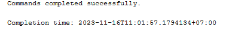
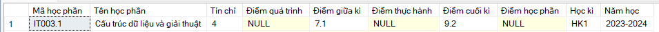
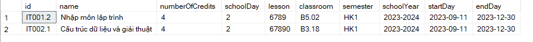
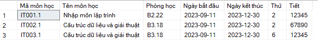
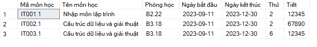
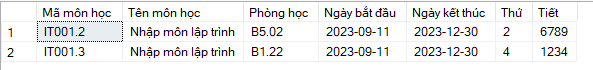

## Update

### Update data

-   Thêm môn `IT002.1` để check đăng kí trùng lịch

```SQL
INSERT into Course(id, name, startDay, endDay, schoolDay, lesson ,classroom, numberOfCredits, semester, schoolYear)
VALUES (N'IT002.1', N'Cấu trúc dữ liệu và giải thuật', '2023-09-11', '2023-12-30', 2, N'67890', N'B3.18', 4, N'HK1', N'2023-2024')

```

-   Điểm môn học chưa được thêm đầy đủ

```SQL
EXEC UpdateScore @idCourse = N'IT003.1',
                @idProfile = N'21521601',
                @processScore = Null,
                @midtermScore = 7.1,
                @finalScore = 9.2,
                @practiceScore = Null
go
```

### Insert Proc

-   Thêm verify username và idProfile là duy nhất

```SQL
create proc InsertAcc
    @username nvarchar(100),
    @password NVARCHAR(1000),
    @id NVARCHAR(100)
AS
BEGIN
    if ((SELECT COUNT(*) FROM Account
            WHERE username = @username) > 0) RETURN

    if ((SELECT COUNT(*) FROM Profile
            WHERE id = @id) > 0) RETURN

    INSERT into Account(username, [password])
    VALUES (@username, @password)

    Insert into Profile(id)
    values (@id)

    INSERT into UserAcc(idAccount, idProfile)
    VALUES (@username, @id)
END
GO

EXEC InsertAcc @username = N'student11',
                @password = N'123456',
                @id = N'21521611'
GO
```

_Test_
Ta không thể thêm trùng username or id

```SQL
EXEC InsertAcc @username = N'student1',
                @password = N'123456',
                @id = N'215216100'
GO

EXEC InsertAcc @username = N'student100',
                @password = N'123456',
                @id = N'21521601'
GO
```

Không có dòng nào affect cả


### UpdateScore Proc

-   Thêm verify điểm số nhập vào phải từ 0 đến 10

```SQL
create PROC UpdateScore
    @idCourse NVARCHAR(100),
    @idProfile NVARCHAR(100),
    @processScore FLOAT,
    @midtermScore FLOAT,
    @finalScore FLOAT,
    @practiceScore FLOAT
AS
BEGIN
    if (
        @processScore < 0 or @processScore > 10 or
        @midtermScore < 0 or @midtermScore > 10 or
        @finalScore < 0 or @processScore > 10 or
        @practiceScore < 0 or @processScore > 10
    ) RETURN

    UPDATE Score
    SET processScore = @processScore,
        midtermScore = @midtermScore,
        finalScore  = @finalScore,
        practiceScore = @practiceScore
    FROM Score, Schedule
    WHERE Schedule.idProfile = @idProfile
        and Schedule.idCourse = @idCourse
        and Schedule.idScore = Score.id
END
GO

EXEC UpdateScore @idCourse = N'IT003.1',
                @idProfile = N'21521601',
                @processScore = 7.3,
                @midtermScore = 7.1,
                @finalScore = 9.2,
                @practiceScore = 10
go
```

_Test_
Ta không thể thêm điểm nhỏ hơn 0 hoặc lớn hơn 10 được

```SQL
EXEC UpdateScore @idCourse = N'IT003.1',
                @idProfile = N'21521601',
                @processScore = -7.3,
                @midtermScore = 7.1,
                @finalScore = 9.2,
                @practiceScore = 11
go
```

Ta thấy điểm không được cập nhật vào DB


### JoinCourse

-   Admin thêm sinh viên vào lớp trực tiếp (môn được thêm có thể không cần đăng kí trước đó) => thời khóa biểu của sv sẽ có môn học đó ngay

```SQL
create PROC JoinCourse
    @idProfile NVARCHAR(100),
    @idCourse NVARCHAR(100)
AS
BEGIN
    -- Không được đăng ký môn ko có trong danh sách các môn được mở
    if ((SELECT COUNT(*) FROM Course
            WHERE id = @idCourse)  = 0) RETURN

    -- Không được đăng kí 1 môn nhiều lần
    IF (SELECT COUNT(*) FROM Schedule
        WHERE idProfile = @idProfile and
                idCourse = @idCourse) > 0 RETURN

    -- Các môn học không được trùng lịch học
    if (select COUNT(*) FROM
        (SELECT schoolDay, lesson FROM Course WHERE id = @idCourse) as infoCourse,
        (SELECT schoolDay, lesson FROM Schedule, Course WHERE Schedule.idCourse = Course.id and Schedule.idProfile = @idProfile) as allInfoCourse
            WHERE infoCourse.schoolDay = allInfoCourse.schoolDay AND
                    (infoCourse.lesson like '%' + allInfoCourse.lesson + '%' or
                        allInfoCourse.lesson like '%' + infoCourse.lesson + '%')) > 0 RETURN

    -- Khi sinh viên đã tham gia lớp học thì phải có bản điểm
    INSERT into Score(processScore)
    VALUES (NULL)

    DECLARE @idScore int

    SELECT @idScore = id FROM  Score
    WHERE id = (SELECT MAX(id)  FROM Score)

    INSERT Schedule (idCourse, idProfile, idScore)
    VALUES (@idCourse, @idProfile, CAST(@idScore as nvarchar))
END
GO

EXEC JoinCourse @idProfile = N'21521601' , @idCourse = N'IT001.1'
```

_Test_



Ta thấy 2 lớp `IT001.2` và `IT002.1` bị trùng lịch nên không thể cùng đăng kí 2 môn này

```SQL
EXEC JoinCourse @idProfile = N'21521601' , @idCourse = N'IT002.1'
EXEC JoinCourse @idProfile = N'21521601' , @idCourse = N'IT001.2'
```



Chỉ đăng kí được mỗi môn `IT002.1`

## Create

### GetListRegisteredByID Proc

-   Get danh sách các môn đã đăng kí học phần
-   _Note_: khác với `GetScheduleByID` get danh sách các môn trong tkb

```SQL
create proc GetListRegisteredByID
    @id nvarchar(100)
AS
BEGIN
    select Course.id as N'Mã môn học',
    Course.name as N'Tên môn học',
    Course.classroom as N'Phòng học',
    Course.startDay as N'Ngày bắt đầu',
    Course.endDay as N'Ngày kết thúc',
    Course.schoolDay as N'Thứ',
    Course.lesson as N'Tiết'
    from RegisterCourse, Course
    WHERE RegisterCourse.idProfile = @id
        and RegisterCourse.idCourse = Course.id
        ORDER BY Course.schoolDay ASC,
            Course.lesson ASC
END
GO

EXEC GetListRegisteredByID @id = N'21521601'
```

Danh sách các môn đã đăng kí


khác với các môn trong thời khóa biểu



### JoinRegisterCourse Proc

-   Sinh viên đăng kí các môn học trong đăng kí học phần, các môn đã đăng kí nếu chưa được admin chấp nhận thì sẽ không được thêm vào tkb của sv đó

```SQL
create PROC JoinRegisterCourse (
    @idProfile NVARCHAR(100),
    @idCourse NVARCHAR(100)
)
AS
BEGIN
    -- Không được đăng ký môn ko có trong danh sách các môn được mở
    if ((SELECT COUNT(*) FROM Course
            WHERE id = @idCourse)  = 0) RETURN

    -- Không được đăng kí 1 môn nhiều lần
    if ((SELECT COUNT(*) FROM RegisterCourse
            WHERE idCourse = @idCourse and
                    idProfile = @idProfile) > 0) RETURN

    -- Các môn học không được trùng lịch học

    if ((SELECT COUNT(*) FROM
            (SELECT Course.schoolDay, Course.lesson FROM Course WHERE id = @idCourse) AS infoCourse,
            (SELECT Course.schoolDay, Course.lesson FROM RegisterCourse, Course WHERE RegisterCourse.idCourse = Course.id and RegisterCourse.idProfile = @idProfile) as allInfoCourse
            WHERE allInfoCourse.schoolDay = infoCourse.schoolDay AND
                    (allInfoCourse.lesson LIKE '%' + infoCourse.lesson + '%' or
                        infoCourse.lesson LIKE '%' + allInfoCourse.lesson + '%'
                    )
        ) > 0) RETURN

    INSERT RegisterCourse(idCourse, idProfile)
    VALUES(@idCourse, @idProfile)
END
GO

EXEC JoinRegisterCourse @idProfile = N'21521601' , @idCourse = N'IT001.1'

```

_Test_


Hai môn `IT001.2` và `IT002.1` bị trùng lịch học nên không thể đăng kí 2 môn cùng lúc

Danh sách các môn đã đăng kí


```SQL
EXEC JoinRegisterCourse @idProfile = N'21521601' , @idCourse = N'IT001.2'
EXEC JoinRegisterCourse @idProfile = N'21521601' , @idCourse = N'IT001.3'
EXEC JoinRegisterCourse @idProfile = N'21521601' , @idCourse = N'IT002.1'
```

### LeaveRegisterCourse Proc

-   Sinh viên thực hiện hủy đăng kí học phần môn học đã đăng kí trước đó

```SQL
create PROC LeaveRegisterCourse (
    @idProfile NVARCHAR(100),
    @idCourse NVARCHAR(100)
)
AS
BEGIN
    DELETE RegisterCourse
    WHERE idCourse = @idCourse AND
            idProfile = @idProfile
end
go

EXEC LeaveRegisterCourse @idProfile = N'21521601' , @idCourse = N'IT001.1'
GO
```
