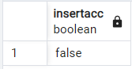
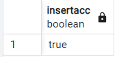
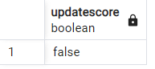
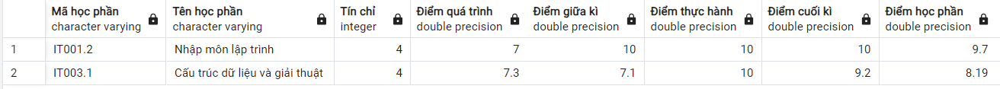
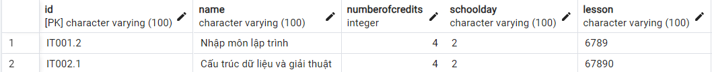
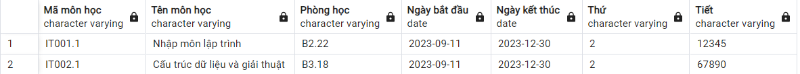
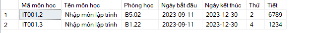
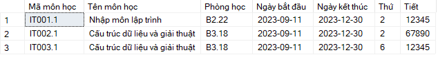
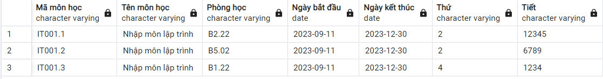

## Update

### Update data

- Thêm môn `IT002.1` để check đăng kí trùng lịch

```SQL
INSERT into Course(id, name, startDay, endDay, schoolDay, lesson ,classroom, numberOfCredits, semester, schoolYear)
VALUES ('IT002.1', 'Cấu trúc dữ liệu và giải thuật', '2023-09-11', '2023-12-30', 2, '67890', 'B3.18', 4, 'HK1', '2023-2024')


```

- Điểm môn học chưa được thêm đầy đủ

```SQL
SELECT UpdateScore('IT003.1','21521601',NULL,7.1,9.2,NULL);

```

### InsertAcc Proc

- Thêm verify username và idProfile là duy nhất

```SQL
CREATE OR REPLACE FUNCTION InsertAcc(
    IN v_username VARCHAR(100),
    IN v_password VARCHAR(1000),
    IN v_id VARCHAR(100)
)
RETURNS Bool AS $$
BEGIN
    IF (SELECT COUNT(*) FROM Account WHERE username = v_username) > 0 THEN
        RETURN false;
    END IF;

    IF (SELECT COUNT(*) FROM Profile WHERE id = v_id) > 0 THEN
        RETURN false;
    END IF;

    INSERT INTO Account(username, password)
    VALUES (v_username, v_password);

    INSERT INTO Profile(id)
    VALUES (v_id);

    INSERT INTO UserAcc(idAccount, idProfile)
    VALUES (v_username, v_id);

    RETURN true;
END;
$$ LANGUAGE plpgsql;
```

_Test_
Ta không thể thêm trùng username or id

```SQL
SELECT InsertAcc('student1', '123456', '215216100');
SELECT InsertAcc('student100', '123456', '21521601');
```

Kết quả trả về false



Nếu chèn thành công sẽ trả về `true`

```SQL
SELECT InsertAcc('student11', '123456', '21521611');
```



### UpdateScore Proc

- Thêm verify điểm số nhập vào phải từ 0 đến 10

```SQL
CREATE OR REPLACE FUNCTION UpdateScore(
    IN v_idCourse VARCHAR(100),
    IN v_idProfile VARCHAR(100),
    IN v_processScore FLOAT,
    IN v_midtermScore FLOAT,
    IN v_finalScore FLOAT,
    IN v_practiceScore FLOAT
)
RETURNS BOOLEAN AS $$
BEGIN
    IF (
        v_processScore < 0 OR v_processScore > 10 OR
        v_midtermScore < 0 OR v_midtermScore > 10 OR
        v_finalScore < 0 OR v_finalScore > 10 OR
        v_practiceScore < 0 OR v_practiceScore > 10
    ) THEN
        RETURN FALSE;
    END IF;

    UPDATE Score AS s
    SET processScore = v_processScore,
        midtermScore = v_midtermScore,
        finalScore = v_finalScore,
        practiceScore = v_practiceScore
    FROM Schedule AS sc
    WHERE sc.idProfile = v_idProfile
        AND sc.idCourse = v_idCourse
        AND sc.idScore = s.id;

    RETURN TRUE;
END;
$$ LANGUAGE plpgsql;
```

_Test_
Ta không thể thêm điểm nhỏ hơn 0 hoặc lớn hơn 10 được

```SQL
SELECT UpdateScore('IT003.1','21521601',-7.3,7.1,9.2,10);
```

Nếu cập nhật thất bại sẽ trả về `false` ngược lại trả về `true`



Ta thấy điểm không được cập nhật vào DB



### JoinCourse

- Admin thêm sinh viên vào lớp trực tiếp (môn được thêm có thể không cần đăng kí trước đó) => thời khóa biểu của sv sẽ có môn học đó ngay

```SQL
CREATE OR REPLACE FUNCTION JoinCourse(
    IN v_idProfile VARCHAR(100),
    IN v_idCourse VARCHAR(100)
)
RETURNS BOOL AS $$
DECLARE
    v_idScore INT;
BEGIN
    -- Không được đăng ký môn ko có trong danh sách các môn được mở
    IF (SELECT COUNT(*) FROM Course WHERE id = v_idCourse) = 0 THEN
        RETURN FALSE;
    END IF;

    -- Không được đăng kí 1 môn nhiều lần
    IF (SELECT COUNT(*) FROM Schedule WHERE idProfile = v_idProfile AND idCourse = v_idCourse) > 0 THEN
        RETURN FALSE;
    END IF;

    -- Các môn học không được trùng lịch học
    IF (SELECT COUNT(*) FROM
        (SELECT schoolDay, lesson FROM Course WHERE id = v_idCourse) AS infoCourse,
        (SELECT schoolDay, lesson FROM Schedule, Course WHERE Schedule.idCourse = Course.id AND Schedule.idProfile = v_idProfile) AS allInfoCourse
        WHERE infoCourse.schoolDay = allInfoCourse.schoolDay AND
            (infoCourse.lesson LIKE '%' || allInfoCourse.lesson || '%' OR
                allInfoCourse.lesson LIKE '%' || infoCourse.lesson || '%')) > 0 THEN
        RETURN FALSE;
    END IF;

    -- Khi sinh viên đã tham gia lớp học thì phải có bản điểm
    INSERT INTO Score(processScore)
    VALUES (NULL)
    RETURNING id INTO v_idScore;

    INSERT INTO Schedule (idCourse, idProfile, idScore)
    VALUES (v_idCourse, v_idProfile, v_idScore);
	RETURN TRUE;
END;
$$ LANGUAGE plpgsql;

-- Execute the function
SELECT JoinCourse('21521601', 'IT001.1');
```

_Test_



Ta thấy 2 lớp `IT001.2` và `IT002.1` bị trùng lịch nên không thể cùng đăng kí 2 môn này

```SQL
SELECT JoinCourse('21521601', 'IT002.1');
SELECT JoinCourse('21521601', 'IT001.2');
```



Chỉ đăng kí được mỗi môn `IT002.1`

## Create

### GetListRegisteredByID Proc

- Get danh sách các môn đã đăng kí học phần
- _Note_: khác với `GetScheduleByID` get danh sách các môn trong tkb

```SQL
CREATE OR REPLACE FUNCTION GetListRegisteredByID(
    IN v_id VARCHAR(100)
)
RETURNS TABLE (
    "Mã môn học" VARCHAR(100),
    "Tên môn học" VARCHAR(100),
    "Phòng học" VARCHAR(100),
    "Ngày bắt đầu" DATE,
    "Ngày kết thúc" DATE,
    "Thứ" VARCHAR(100),
    "Tiết" VARCHAR(100)
) AS $$
BEGIN
    RETURN QUERY
    SELECT
        Course.id AS "Mã môn học",
        Course.name AS "Tên môn học",
        Course.classroom AS "Phòng học",
        Course.startDay AS "Ngày bắt đầu",
        Course.endDay AS "Ngày kết thúc",
        Course.schoolDay AS "Thứ",
        Course.lesson AS "Tiết"
    FROM
        RegisterCourse
    INNER JOIN
        Course ON RegisterCourse.idCourse = Course.id
    WHERE
        RegisterCourse.idProfile = v_id
    ORDER BY
        Course.schoolDay ASC,
        Course.lesson ASC;
END;
$$ LANGUAGE plpgsql;
```

Danh sách các môn đã đăng kí



khác với các môn trong thời khóa biểu



### JoinRegisterCourse Proc

- Sinh viên đăng kí các môn học trong đăng kí học phần, các môn đã đăng kí nếu chưa được admin chấp nhận thì sẽ không được thêm vào tkb của sv đó

```SQL
CREATE OR REPLACE FUNCTION JoinRegisterCourse(
    IN v_idProfile VARCHAR(100),
    IN v_idCourse VARCHAR(100)
)
RETURNS BOOL AS $$
BEGIN
    -- Không được đăng ký môn ko có trong danh sách các môn được mở
    IF (SELECT COUNT(*) FROM Course WHERE id = v_idCourse) = 0 THEN
        RETURN FALSE;
    END IF;

    -- Không được đăng kí 1 môn nhiều lần
    IF (SELECT COUNT(*) FROM RegisterCourse WHERE idCourse = v_idCourse AND idProfile = v_idProfile) > 0 THEN
        RETURN FALSE;
    END IF;

    -- Các môn học không được trùng lịch học
    IF (SELECT COUNT(*) FROM
        (SELECT Course.schoolDay, Course.lesson FROM Course WHERE id = v_idCourse) AS infoCourse,
        (SELECT Course.schoolDay, Course.lesson FROM RegisterCourse, Course WHERE RegisterCourse.idCourse = Course.id AND RegisterCourse.idProfile = v_idProfile) AS allInfoCourse
        WHERE allInfoCourse.schoolDay = infoCourse.schoolDay AND
            (allInfoCourse.lesson LIKE '%' || infoCourse.lesson || '%' OR
                infoCourse.lesson LIKE '%' || allInfoCourse.lesson || '%'
            )
        ) > 0 THEN
        RETURN FALSE;
    END IF;

    INSERT INTO RegisterCourse(idCourse, idProfile)
    VALUES(v_idCourse, v_idProfile);

	RETURN TRUE;
END;
$$ LANGUAGE plpgsql;

```

_Test_


Hai môn `IT001.2` và `IT002.1` bị trùng lịch học nên không thể đăng kí 2 môn cùng lúc

```SQL
SELECT JoinRegisterCourse('21521601', 'IT001.1');
SELECT JoinRegisterCourse('21521601', 'IT001.2');
SELECT JoinRegisterCourse('21521601', 'IT001.3');
SELECT JoinRegisterCourse('21521601', 'IT002.1');
```

Danh sách các môn đã đăng kí



### LeaveRegisterCourse Proc

- Sinh viên thực hiện hủy đăng kí học phần môn học đã đăng kí trước đó

```SQL
CREATE OR REPLACE FUNCTION LeaveRegisterCourse(
    IN v_idProfile VARCHAR(100),
    IN v_idCourse VARCHAR(100)
)
RETURNS VOID AS $$
BEGIN
    DELETE FROM RegisterCourse
    WHERE idCourse = v_idCourse AND idProfile = v_idProfile;
END;
$$ LANGUAGE plpgsql;

SELECT LeaveRegisterCourse('21521601', 'IT001.1');
```
