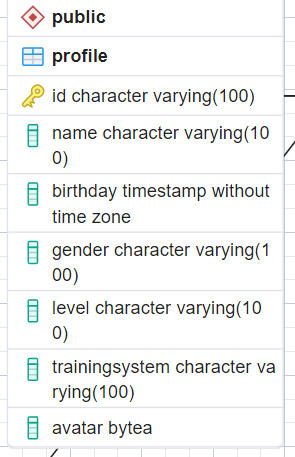

### Update Profile Table

Thay đổi kiểu dữ liệu của cột `birthday` từ `DATE` => `TIMESTAMP`

Để thay đổi ta chạy câu lệnh

```SQL
ALTER TABLE Profile
ALTER COLUMN birthday TYPE TIMESTAMP
```

Bảng `Profile` nên là



### Update LoadProfileById

_Note_: Khi update các `function` ta cần <b style="color: red">Xóa</b> và tạo lại với lệnh

```SQL
CREATE OR REPLACE FUNCTION LoadProfileById(_id VARCHAR(100))
RETURNS TABLE("MSSV" VARCHAR(100), "Tên" VARCHAR(100), "Ngày sinh" TIMESTAMP, "Giới tính" VARCHAR(100), "Bậc đào tạo" VARCHAR(100), "Hệ đào tạo" VARCHAR(100), "Ảnh đại diện" BYTEA) AS $$
BEGIN
    RETURN QUERY
    SELECT id as "MSSV",
           name as "Tên",
           birthday as "Ngày sinh",
           gender as "Giới tính",
           level as "Bậc đào tạo",
           trainingSystem as "Hệ đào tạo",
           avatar as "Ảnh đại diện"
    FROM Profile
    WHERE id = _id;
END;
$$ LANGUAGE plpgsql;
```

### Update UpdateProfile

```SQL
CREATE OR REPLACE FUNCTION UpdateProfile(_id VARCHAR(100), _name VARCHAR(100), _birthday TIMESTAMP, _gender VARCHAR(100), _level VARCHAR(100), _trainingSystem VARCHAR(100), _avatar BYTEA)
RETURNS VOID AS $$
BEGIN
    UPDATE Profile
    SET name = _name,
        birthday = _birthday,
        gender = _gender,
        level = _level,
        trainingsystem = _trainingSystem,
        avatar = _avatar
    WHERE id = _id;
END;
$$ LANGUAGE plpgsql;
```
