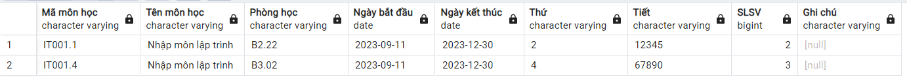

### Update GetClassInCharge

Thêm các trường `Phòng học`, `ngày bắt đầu`, `ngày kết thúc`

_Note_: Khi update các `function` ta cần <b style="color: red">Xóa</b> và tạo lại với lệnh

```SQL
CREATE OR REPLACE FUNCTION GetClassInCharge(_id VARCHAR(100))
RETURNS TABLE("Mã môn học" VARCHAR(100), "Tên môn học" VARCHAR(100), "Phòng học" VARCHAR(100), "Ngày bắt đầu" DATE, "Ngày kết thúc" DATE, "Thứ" VARCHAR(100), "Tiết" VARCHAR(100), "SLSV" BIGINT, "Ghi chú" VARCHAR(100)) AS $$
BEGIN
    RETURN QUERY
    SELECT Course.id as "Mã môn học",
           Course.name as "Tên môn học",
		   Course.classroom as "Phòng học",
           Course.startDay as "Ngày bắt đầu",
           Course.endDay as "Ngày kết thúc",
           Course.schoolDay as "Thứ",
           Course.lesson as "Tiết",
           COUNT(*) as "SLSV",
           Schedule.note as "Ghi chú"
    FROM Schedule
    JOIN Course ON Schedule.idCourse = Course.id
    WHERE NOT Schedule.idProfile = _id
      AND Schedule.idCourse IN (
        SELECT Course.id
        FROM Schedule
        JOIN Course ON Schedule.idCourse = Course.id
        WHERE Schedule.idProfile = _id
      )
    GROUP BY Course.id, Course.name, Course.schoolDay, Course.lesson, Schedule.note, Course.classroom, Course.startDay, Course.endDay;
END;
$$ LANGUAGE plpgsql;
```

_Example_

```SQL
SELECT * FROM GetClassInCharge('GV2');
```


