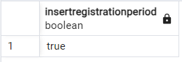
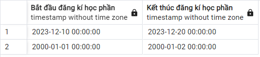
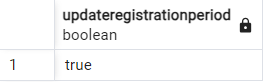
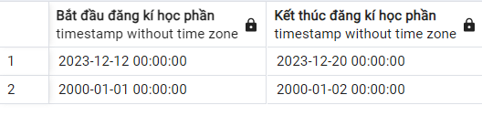
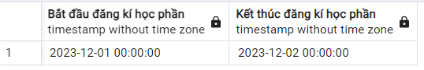
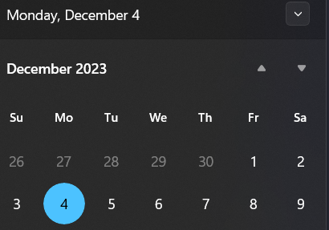
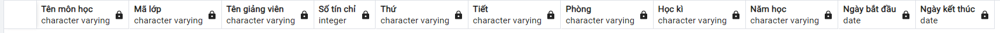
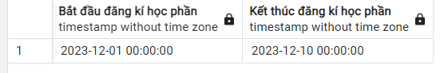
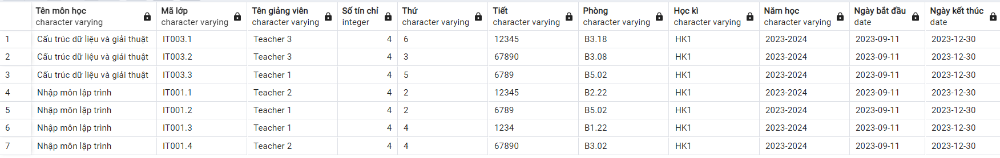

# Create table RegistrationPeriod

-   Bảng `RegistrationPeriod` lưu thời gian bắt đầu và kết thúc đăng ký học phần

```SQL
CREATE TABLE RegistrationPeriod (
    id SERIAL PRIMARY KEY,
    startTime TIMESTAMP,
    endTime TIMESTAMP,
    CHECK (endTime > startTime)
);
```

## Insert data

```SQL
INSERT INTO RegistrationPeriod(startTime, endTime)
VALUES ('2000-01-01', '2000-01-02');
```

## CRUD

### InsertRegistrationPeriod

Thêm thời gian bắt đầu và kết thúc đăng kí học phần với điều kiện:

-   Thời gian bắt đầu phải bé hơn thời gian kết thúc
-   Thời gian kết thúc phải lớn hơn thời gian hiện tại
-   Thời gian bắt đầu lần mở đăng kí sau phải lớn hơn thời gian kết thúc của lần mở trước đó

```SQL
CREATE OR REPLACE FUNCTION InsertRegistrationPeriod(
    IN _startTime TIMESTAMP,
    IN _endTime TIMESTAMP
)
RETURNS Bool AS $$
DECLARE
    lastEndTime TIMESTAMP;
BEGIN
    SELECT endTime INTO lastEndTime FROM RegistrationPeriod ORDER BY id DESC LIMIT 1;

    IF _startTime < lastEndTime THEN
        RETURN false;
    END IF;

    IF _endTime <= _startTime THEN
        RETURN false;
    END IF;

    IF _endTime < CURRENT_TIMESTAMP THEN
        RETURN false;
    END IF;

    INSERT INTO RegistrationPeriod(startTime, endTime)
    VALUES (_startTime, _endTime);

    RETURN true;
END;
$$ LANGUAGE plpgsql;

```

_Example_

```SQL
select InsertRegistrationPeriod('2023-12-10', '2023-12-20')
```





### updateRegistrationPeriod

Thêm thời gian bắt đầu và kết thúc đăng kí học phần với điều kiện:

-   Thời gian bắt đầu phải bé hơn thời gian kết thúc
-   Thời gian kết thúc phải lớn hơn thời gian hiện tại
-   Thời gian bắt đầu lần mở đăng kí sau phải lớn hơn thời gian bắt đầu của lần mở trước đó

```SQL
CREATE OR REPLACE FUNCTION updateRegistrationPeriod(p_startTime TIMESTAMP, p_endTime TIMESTAMP)
RETURNS BOOL AS $$
DECLARE
    prevEndTime TIMESTAMP;
BEGIN
    SELECT endTime INTO prevEndTime
    FROM RegistrationPeriod
    WHERE id = (SELECT MAX(id) FROM RegistrationPeriod) - 1;

    IF p_startTime <= prevEndTime THEN
        RETURN FALSE;
    END IF;

	IF p_endTime <= p_startTime THEN
        RETURN FALSE;
    END IF;

    IF p_endTime < CURRENT_TIMESTAMP THEN
        RETURN FALSE;
    END IF;

    UPDATE RegistrationPeriod
    SET startTime = p_startTime, endTime = p_endTime
    WHERE id = (SELECT MAX(id) FROM RegistrationPeriod);

    RETURN TRUE;
END;
$$ LANGUAGE plpgsql;

-- select updateRegistrationPeriod('2023-12-12', '2023-12-20')

CREATE OR REPLACE FUNCTION GetListRegistrationPeriod()
RETURNS TABLE("Bắt đầu đăng kí học phần" TIMESTAMP, "Kết thúc đăng kí học phần" TIMESTAMP) AS $$
BEGIN
    RETURN QUERY
    SELECT startTime AS "Bắt đầu đăng kí học phần", endTime AS "Kết thúc đăng kí học phần"
	FROM RegistrationPeriod
    ORDER BY endTime DESC;

END;
$$ LANGUAGE plpgsql;


```

_Example_

```SQL
select updateRegistrationPeriod('2023-12-12', '2023-12-20')
```



### Store procedure

Lấy danh sách các khoảng thời gian mở đăng kí học phần, sắp xếp theo thời gian mới nhất

```SQL
CREATE OR REPLACE FUNCTION GetListRegistrationPeriod()
RETURNS TABLE("Bắt đầu đăng kí học phần" TIMESTAMP, "Kết thúc đăng kí học phần" TIMESTAMP) AS $$
BEGIN
    RETURN QUERY
    SELECT startTime AS "Bắt đầu đăng kí học phần", endTime AS "Kết thúc đăng kí học phần"
	FROM RegistrationPeriod
    ORDER BY endTime DESC;

END;
$$ LANGUAGE plpgsql;
```

_Example_

```SQL
select * from GetListRegistrationPeriod();
```



### Update function GetListRegisterCourse()

Nếu thời gian hiện tại lớn hơn thời gian kết thúc của đăng kí học phần sẽ trả về `null`

_Note_: Khi update các `function` ta cần <b style="color: red">Xóa</b> và tạo lại với lệnh

```SQL
CREATE OR REPLACE FUNCTION GetListRegisterCourse()
RETURNS TABLE(
    "Tên môn học" VARCHAR(100),
    "Mã lớp" VARCHAR(100),
    "Tên giảng viên" VARCHAR(100),
    "Số tín chỉ" INT,
    "Thứ" VARCHAR(100),
    "Tiết" VARCHAR(100),
    "Phòng" VARCHAR(100),
    "Học kì" VARCHAR(100),
    "Năm học" VARCHAR(100),
    "Ngày bắt đầu" DATE,
    "Ngày kết thúc" DATE
) AS $$
BEGIN
    IF CURRENT_TIMESTAMP > (SELECT endTime FROM RegistrationPeriod ORDER BY id DESC LIMIT 1) THEN
        RETURN QUERY SELECT NULL::VARCHAR, NULL::VARCHAR, NULL::VARCHAR, NULL::INT, NULL::VARCHAR, NULL::VARCHAR, NULL::VARCHAR, NULL::VARCHAR, NULL::VARCHAR, NULL::DATE, NULL::DATE WHERE false;
    ELSE
        RETURN QUERY
        SELECT Course.name as "Tên môn học",
               Course.id as "Mã lớp",
               Profile.name as "Tên giảng viên",
               Course.numberOfCredits as "Số tín chỉ",
               Course.schoolDay as "Thứ",
               Course.lesson as "Tiết",
               Course.classroom as "Phòng",
               Course.semester as "Học kì",
               Course.schoolYear as "Năm học",
               Course.startDay as "Ngày bắt đầu",
               Course.endDay as "Ngày kết thúc"
        FROM Schedule
        JOIN Course ON Schedule.idCourse = Course.id
        JOIN Profile ON Schedule.idProfile = Profile.id
        JOIN UserAcc ON Profile.id = UserAcc.idProfile
        JOIN Account ON UserAcc.idAccount = Account.username
        WHERE Account.role = 'teacher'
        ORDER BY Course.name, Course.id;
    END IF;
END;
$$ LANGUAGE plpgsql;
```

_Example_

Thời gian đăng kí học phần



Thời gian hiện tại



```SQL
SELECT * FROM GetListRegisterCourse();
```

Quá hạn đăng kí học phần nên không load được danh sách các môn đăng kí học phần



Nếu còn hạn sẽ load bình thường




