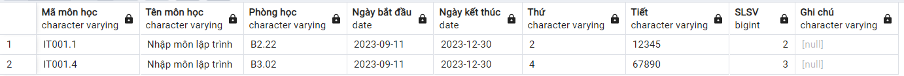

### Update GetListRegisteredByID

Update các trường giống với `GetListRegisterCourse()`

_Note_: Khi update các `function` ta cần <b style="color: red">Xóa</b> và tạo lại với lệnh

```SQL
CREATE OR REPLACE FUNCTION GetListRegisteredByID(
    IN v_id VARCHAR(100)
)
RETURNS TABLE("Tên môn học" VARCHAR(100), "Mã lớp" VARCHAR(100), "Tên giảng viên" VARCHAR(100), "Số tín chỉ" INT, "Thứ" VARCHAR(100), "Tiết" VARCHAR(100), "Phòng" VARCHAR(100), "Học kì" VARCHAR(100), "Năm học" VARCHAR(100), "Ngày bắt đầu" DATE, "Ngày kết thúc" DATE) AS $$
BEGIN
    RETURN QUERY
    SELECT
		"GLRC"."Tên môn học",
		"GLRC"."Mã lớp",
		"GLRC"."Tên giảng viên",
		"GLRC"."Số tín chỉ",
		"GLRC"."Thứ",
		"GLRC"."Tiết",
		"GLRC"."Phòng",
		"GLRC"."Học kì",
		"GLRC"."Năm học",
		"GLRC"."Ngày bắt đầu",
		"GLRC"."Ngày kết thúc"
	FROM GetListRegisterCourse() AS "GLRC"
	JOIN RegisterCourse ON RegisterCourse.idCourse = "GLRC"."Mã lớp"
	WHERE
        RegisterCourse.idProfile = v_id
    ORDER BY
        "GLRC"."Thứ" ASC,
		"GLRC"."Tiết" ASC;

END;
$$ LANGUAGE plpgsql;
```

_Example_

```SQL
SELECT * FROM GetListRegisteredByID('21521601');
```


