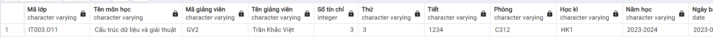
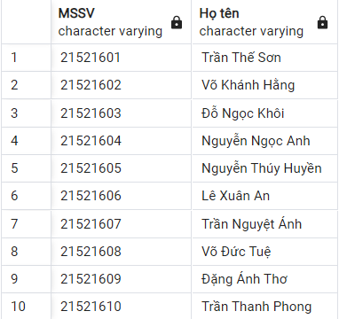

# Update

## GetListRegisterCourse()

Thêm cột mã giảng viên

```SQL
CREATE OR REPLACE FUNCTION GetListRegisterCourse()
RETURNS TABLE(
	"Mã lớp" VARCHAR(100),
    "Tên môn học" VARCHAR(100),
    "Mã giảng viên" VARCHAR(100),
    "Tên giảng viên" VARCHAR(100),
    "Số tín chỉ" INT,
    "Thứ" VARCHAR(100),
    "Tiết" VARCHAR(100),
    "Phòng" VARCHAR(100),
    "Học kì" VARCHAR(100),
    "Năm học" VARCHAR(100),
    "Ngày bắt đầu" DATE,
    "Ngày kết thúc" DATE
) AS $$
BEGIN

    -- Nếu quá thời hạn đăng kí học phần sẽ không load được kết quả
    IF CURRENT_TIMESTAMP > (SELECT endTime FROM RegistrationPeriod ORDER BY id DESC LIMIT 1) THEN
        RETURN;
    ELSE
        RETURN QUERY
        SELECT Course.id as "Mã lớp",
			   Course.name as "Tên môn học",
               Profile.id as "Mã giảng viên",
               Profile.name as "Tên giảng viên",
               Course.numberOfCredits as "Số tín chỉ",
               Course.schoolDay as "Thứ",
               Course.lesson as "Tiết",
               Course.classroom as "Phòng",
               Course.semester as "Học kì",
               Course.schoolYear as "Năm học",
               Course.startDay as "Ngày bắt đầu",
               Course.endDay as "Ngày kết thúc"
        FROM Schedule
        JOIN Course ON Schedule.idCourse = Course.id
        JOIN Profile ON Schedule.idProfile = Profile.id
        JOIN UserAcc ON Profile.id = UserAcc.idProfile
        JOIN Account ON UserAcc.idAccount = Account.username
        WHERE Account.role = 'teacher'
        ORDER BY Course.name, Course.id;
    END IF;
END;
$$ LANGUAGE plpgsql;

```

_Example:_

```SQL
SELECT * FROM GetListRegisterCourse();
```



## UpdateScore

Check điều kiện đểm từ `[0, 10]`

```SQL
CREATE OR REPLACE FUNCTION UpdateScore(
    IN v_idCourse VARCHAR(100),
    IN v_idProfile VARCHAR(100),
    IN v_processScore FLOAT,
    IN v_midtermScore FLOAT,
    IN v_finalScore FLOAT,
    IN v_practiceScore FLOAT
)
RETURNS BOOLEAN AS $$
BEGIN
    IF (
        v_processScore < 0 OR v_processScore > 10 or
        v_midtermScore < 0 OR v_midtermScore > 10 or
        v_finalScore < 0 OR v_finalScore > 10 or
        v_practiceScore < 0 or v_practiceScore > 10
    ) THEN
        RETURN FALSE;
    END IF;

    UPDATE Score AS s
    SET processScore = v_processScore,
        midtermScore = v_midtermScore,
        finalScore = v_finalScore,
        practiceScore = v_practiceScore
    FROM Schedule AS sc
    WHERE sc.idProfile = v_idProfile
        AND sc.idCourse = v_idCourse
        AND sc.idScore = s.id;

    RETURN TRUE;
END;
$$ LANGUAGE plpgsql;
```

_Example:_

```SQL
SELECT UpdateScore('IT006.O14', '21521601', 8.3, null, 9.2, null);
```

## AcceptCourse

Thêm điều kiện không được đăng kí trùng môn khác ngày học ví dụ IT003.O11 và IT003.O12

```SQL
CREATE OR REPLACE FUNCTION AcceptCourse(
    IN v_idProfile VARCHAR(100),
    IN v_idCourse VARCHAR(100)
)
RETURNS BOOL AS $$
DECLARE
    v_idScore INT;
BEGIN
    -- Không được đăng ký môn ko có trong danh sách các môn được mở
    IF (SELECT COUNT(*) FROM Course WHERE id = v_idCourse) = 0 THEN
        RETURN FALSE;
    END IF;

    -- Không được đăng kí 1 môn nhiều lần
    IF (SELECT COUNT(*) FROM Schedule WHERE idProfile = v_idProfile AND idCourse = v_idCourse) > 0 THEN
        RETURN FALSE;
    END IF;

	-- Không được đăng kí trùng môn khác ngày học ví dụ IT003.O11 và IT003.O12
	IF (SELECT COUNT(*)
		FROM Schedule
		WHERE idProfile = v_idProfile
		AND substring(idCourse from 1 for position('.' in idCourse)-1) = substring(v_idCourse from 1 for position('.' in v_idCourse)-1)
	) > 0 THEN
        RETURN FALSE;
    END IF;

    -- Các môn học không được trùng lịch học
    IF (SELECT COUNT(*) FROM
        (SELECT schoolDay, lesson FROM Course WHERE id = v_idCourse) AS infoCourse,
        (SELECT schoolDay, lesson FROM Schedule, Course WHERE Schedule.idCourse = Course.id AND Schedule.idProfile = v_idProfile) AS allInfoCourse
        WHERE infoCourse.schoolDay = allInfoCourse.schoolDay AND
            (infoCourse.lesson LIKE '%' || allInfoCourse.lesson || '%' OR
                allInfoCourse.lesson LIKE '%' || infoCourse.lesson || '%')) > 0 THEN
        RETURN FALSE;
    END IF;

    -- Khi sinh viên đã tham gia lớp học thì phải có bản điểm
    INSERT INTO Score(processScore)
    VALUES (NULL)
    RETURNING id INTO v_idScore;

    INSERT INTO Schedule (idCourse, idProfile, idScore)
    VALUES (v_idCourse, v_idProfile, v_idScore);
	RETURN TRUE;
END;
$$ LANGUAGE plpgsql;

```

_Example:_

```SQL
SELECT AcceptCourse('21521601', 'IT006.O14');
```

## JoinRegisterCourse

Thêm điều kiện không được đăng kí trùng môn khác ngày học ví dụ IT003.O11 và IT003.O12

```SQL
CREATE OR REPLACE FUNCTION JoinRegisterCourse(
    IN v_idProfile VARCHAR(100),
    IN v_idCourse VARCHAR(100)
)
RETURNS BOOL AS $$
BEGIN
    -- Không được đăng ký môn ko có trong danh sách các môn được mở
    IF (SELECT COUNT(*) FROM Course WHERE id = v_idCourse) = 0 THEN
        RETURN FALSE;
    END IF;

    -- Không được đăng kí 1 môn nhiều lần
    IF (SELECT COUNT(*) FROM RegisterCourse WHERE idCourse = v_idCourse AND idProfile = v_idProfile) > 0 THEN
        RETURN FALSE;
    END IF;

	-- Không được đăng kí trùng môn khác ngày học ví dụ IT003.O11 và IT003.O12
	IF (SELECT COUNT(*)
		FROM RegisterCourse
		WHERE idProfile = v_idProfile
		AND substring(idCourse from 1 for position('.' in idCourse)-1) = substring(v_idCourse from 1 for position('.' in v_idCourse)-1)
	) > 0 THEN
        RETURN FALSE;
    END IF;

    -- Các môn học không được trùng lịch học
    IF (SELECT COUNT(*) FROM
        (SELECT Course.schoolDay, Course.lesson FROM Course WHERE id = v_idCourse) AS infoCourse,
        (SELECT Course.schoolDay, Course.lesson FROM RegisterCourse, Course WHERE RegisterCourse.idCourse = Course.id AND RegisterCourse.idProfile = v_idProfile) AS allInfoCourse
        WHERE allInfoCourse.schoolDay = infoCourse.schoolDay AND
            (allInfoCourse.lesson LIKE '%' || infoCourse.lesson || '%' OR
                infoCourse.lesson LIKE '%' || allInfoCourse.lesson || '%'
            )
        ) > 0 THEN
        RETURN FALSE;
    END IF;

    INSERT INTO RegisterCourse(idCourse, idProfile)
    VALUES(v_idCourse, v_idProfile);

	RETURN TRUE;
END;
$$ LANGUAGE plpgsql;

```

_Example:_

```SQL
SELECT JoinRegisterCourse('21521601', 'IT006.O14');
```

# Create

## getListStudents()

Lấy danh sách tất cả sinh viên

```SQL
create or replace function getListStudents()
returns table (
	"MSSV" varchar(100),
	"Họ tên" varchar(100)
) as $$
BEGIN
	return query
	select
		profile.id as "MSSV",
		profile.name as "Họ tên"
	from profile, useracc, account
	where useracc.idprofile = profile.id
		and useracc.idaccount = account.username
		and account."role" = 'student';
end;
$$ language plpgsql;
```

_Example:_

```SQL
select * from getListStudents()
```



## insertRegisterCourse

Chèn danh sách đăng kí học phần

```SQL
CREATE OR REPLACE FUNCTION insertRegisterCourse(
    IN courseId VARCHAR(100),
    IN courseName VARCHAR(100),
    IN profileId VARCHAR(100),
    IN profileName VARCHAR(100),
    IN courseNumberOfCredits INT,
    IN courseSchoolDay VARCHAR(100),
    IN courseLesson VARCHAR(100),
    IN courseClassroom VARCHAR(100),
    IN courseSemester VARCHAR(100),
    IN courseSchoolYear VARCHAR(100),
    IN courseStartDay DATE,
    IN courseEndDay DATE
)
RETURNS BOOLEAN AS $$
DECLARE
    lastEndTime TIMESTAMP;
    lastStartTime TIMESTAMP;
BEGIN
    -- Không được sửa danh sách dkhp khi đăng mở đăng kí
    SELECT starttime, endtime INTO lastStartTime, lastEndTime FROM RegistrationPeriod ORDER BY starttime DESC LIMIT 1;

    IF (lastStartTime <= CURRENT_TIMESTAMP) AND (lastEndTime > CURRENT_TIMESTAMP) THEN
        RETURN FALSE;
    END IF;


	INSERT INTO public.course (id, name, numberofcredits, schoolday, lesson, classroom, semester, schoolyear, startday, endday)
	VALUES (courseId, courseName, courseNumberOfCredits, courseSchoolDay, courseLesson, courseClassroom, courseSemester, courseSchoolYear, courseStartDay, courseEndDay);

	INSERT INTO public.schedule (idprofile, idcourse, idscore, note) VALUES (profileId, courseId, NULL, NULL);

    UPDATE Profile
    SET
        name = profileName
    WHERE
        id = profileId;

    RETURN TRUE;
END;
$$ LANGUAGE plpgsql;
```

### updateRegistrationPeriod

```SQL
CREATE OR REPLACE FUNCTION updateRegistrationPeriod(p_startTime TIMESTAMP, p_endTime TIMESTAMP)
RETURNS BOOL AS $$
DECLARE
    lastEndTime TIMESTAMP;
    lastStartTime TIMESTAMP;
BEGIN
	IF p_endTime <= p_startTime THEN
        RETURN FALSE;
    END IF;

    IF p_endTime < CURRENT_TIMESTAMP THEN
        RETURN FALSE;
    END IF;

    UPDATE RegistrationPeriod
    SET startTime = p_startTime, endTime = p_endTime
    WHERE id = (SELECT id FROM RegistrationPeriod ORDER BY endtime DESC LIMIT 1);

    RETURN TRUE;
END;
$$ LANGUAGE plpgsql;

```

### updateRegisterCourse

Cập nhật danh sách đăng kí học phần

```SQL
CREATE OR REPLACE FUNCTION updateRegisterCourse(
    IN courseId VARCHAR(100),
    IN courseName VARCHAR(100),
    IN profileId VARCHAR(100),
    IN profileName VARCHAR(100),
    IN courseNumberOfCredits INT,
    IN courseSchoolDay VARCHAR(100),
    IN courseLesson VARCHAR(100),
    IN courseClassroom VARCHAR(100),
    IN courseSemester VARCHAR(100),
    IN courseSchoolYear VARCHAR(100),
    IN courseStartDay DATE,
    IN courseEndDay DATE
)
RETURNS BOOLEAN AS $$
DECLARE
    lastEndTime TIMESTAMP;
    lastStartTime TIMESTAMP;
BEGIN
    SELECT starttime, endtime INTO lastStartTime, lastEndTime FROM RegistrationPeriod ORDER BY starttime DESC LIMIT 1;

    -- Không được sửa danh sách dkhp khi đăng mở đăng kí

    IF (lastStartTime <= CURRENT_TIMESTAMP) AND (lastEndTime > CURRENT_TIMESTAMP) THEN
        RETURN FALSE;
    END IF;

    UPDATE Course
    SET
        name = courseName,
        numberOfCredits = courseNumberOfCredits,
        schoolDay = courseSchoolDay,
        lesson = courseLesson,
        classroom = courseClassroom,
        semester = courseSemester,
        schoolYear = courseSchoolYear,
        startDay = courseStartDay,
        endDay = courseEndDay
    WHERE
        id = courseId;

    UPDATE Profile
    SET
        name = profileName
    WHERE
        id = profileId;

    RETURN TRUE;
END;
$$ LANGUAGE plpgsql;
```

_Example:_

```SQL
SELECT updateregistercourse('IT003.O11', 'Cấu trúc dữ liệu và giải thuật 2', 'GV2', 'Trần Khắc Việt 2', 4, '3', '1234', 'C312', 'HK1', '2023-2024', '2023-09-11', '2024-01-06')
```

_Example:_

```SQL
select updateRegistrationPeriod('2023-12-24', '2023-12-25')
```

## ClearRegisterCourse()

Xóa danh sách các đăng kí học phần

```SQL
CREATE OR REPLACE FUNCTION clearRegisterCourse()
RETURNS VOID
AS $$
BEGIN
	delete from Schedule;
	delete from RegisterCourse;
	delete from Score;
	delete from Course;
END;
$$ LANGUAGE plpgsql;
```

_Example:_

```SQL
SELECT FROM clearRegisterCourse()
```

# Delete

Xóa hàm InsertRegistrationPeriod vì trong DB chỉ luôn tồn tại 1 khoảng thời gian để đăng kí học phần

# Note

_Note_: Khi update các `function` ta cần <b style="color: red">Xóa</b> và tạo lại với lệnh

## Import danh sách đăng kí học phần

-   Danh sách `import` phải **cùng format** (thứ tự các cột) giống với file danh sách khi `export`

-   Lúc thực hiện `import` cần gọi hàm `ClearRegisterCourse()` để xóa dữ liệu, sau đó chèn từng dòng với hàm `insertRegisterCourse()`

-   Khi `update` danh sách đăng kí học phần với hàm `updateRegisterCourse()` không được update trường `Mã lớp` với `Mã giảng viên`, các trường còn lại `update` bình thường
