# Update

## AcceptCourse

Thêm acction xóa môn đã được accept khỏi danh sách dkhp

```SQL
CREATE OR REPLACE FUNCTION AcceptCourse(
    IN v_idProfile VARCHAR(100),
    IN v_idCourse VARCHAR(100)
)
RETURNS BOOL AS $$
DECLARE
    v_idScore INT;
BEGIN
    -- Không được đăng ký môn ko có trong danh sách các môn được mở
    IF (SELECT COUNT(*) FROM Course WHERE id = v_idCourse) = 0 THEN
        RETURN FALSE;
    END IF;

    -- Không được đăng kí 1 môn nhiều lần
    IF (SELECT COUNT(*) FROM Schedule WHERE idProfile = v_idProfile AND idCourse = v_idCourse) > 0 THEN
        RETURN FALSE;
    END IF;

	-- Không được đăng kí trùng môn khác ngày học ví dụ IT003.O11 và IT003.O12
	IF (SELECT COUNT(*)
		FROM Schedule
		WHERE idProfile = v_idProfile
		AND substring(idCourse from 1 for position('.' in idCourse)-1) = substring(v_idCourse from 1 for position('.' in v_idCourse)-1)
	) > 0 THEN
        RETURN FALSE;
    END IF;

    -- Các môn học không được trùng lịch học
    IF (SELECT COUNT(*) FROM
        (SELECT schoolDay, lesson FROM Course WHERE id = v_idCourse) AS infoCourse,
        (SELECT schoolDay, lesson FROM Schedule, Course WHERE Schedule.idCourse = Course.id AND Schedule.idProfile = v_idProfile) AS allInfoCourse
        WHERE infoCourse.schoolDay = allInfoCourse.schoolDay AND
            (infoCourse.lesson LIKE '%' || allInfoCourse.lesson || '%' OR
                allInfoCourse.lesson LIKE '%' || infoCourse.lesson || '%')) > 0 THEN
        RETURN FALSE;
    END IF;

    -- Khi sinh viên đã tham gia lớp học thì phải có bản điểm
    INSERT INTO Score(processScore)
    VALUES (NULL)
    RETURNING id INTO v_idScore;

    INSERT INTO Schedule (idCourse, idProfile, idScore)
    VALUES (v_idCourse, v_idProfile, v_idScore);

	-- 	Xoá môn đã được accept khỏi danh sách dkhp
	delete from RegisterCourse
	where idProfile = v_idProfile
		and idCourse = v_idCourse;

	RETURN TRUE;
END;
$$ LANGUAGE plpgsql;
```

_Example:_

```SQL
SELECT AcceptCourse('21521601', 'IT006.O14');
```

Ban đầu tkb và danh sách dkhp chưa có môn `IT004.O14`

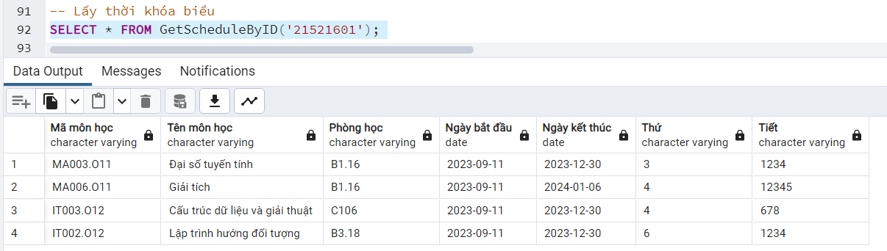

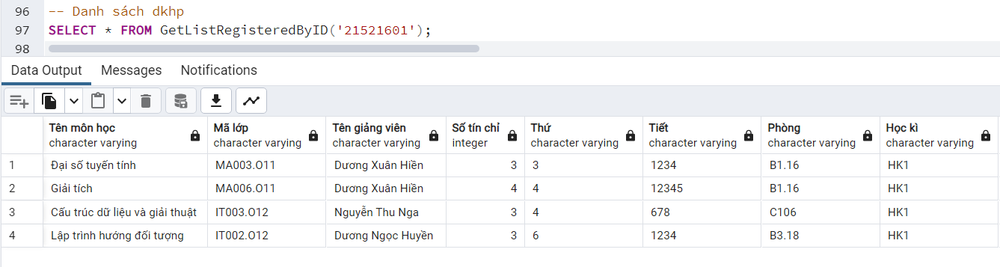

Đăng kí môn `IT004.O14`

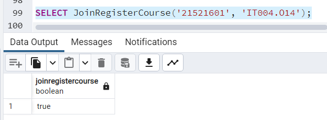

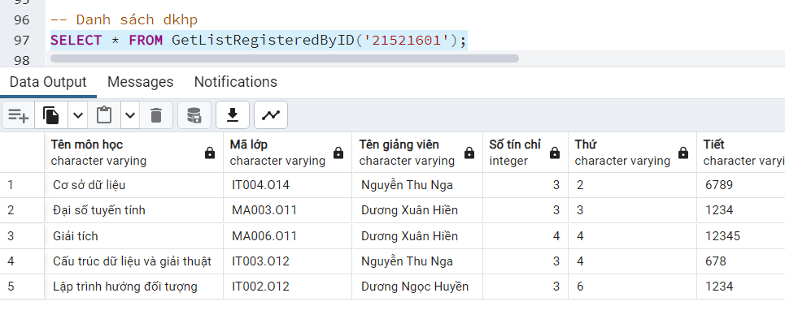

Accept môn `IT004.O14`

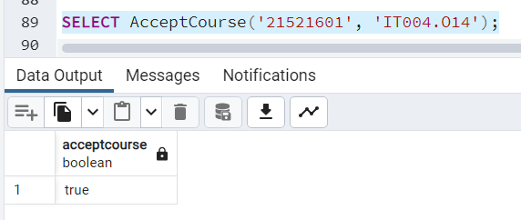

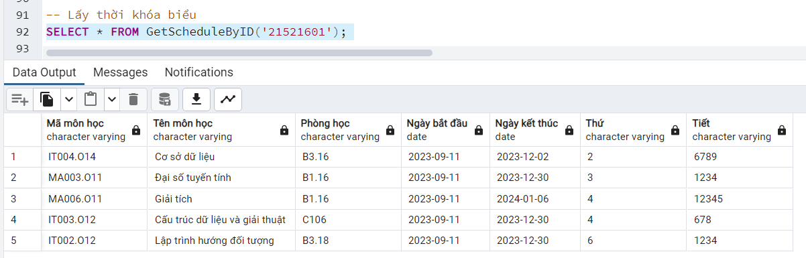

Sau khi đã accept môn `IT004.O14`, ta sẽ xóa môn đó ra khỏi danh sách dkhp

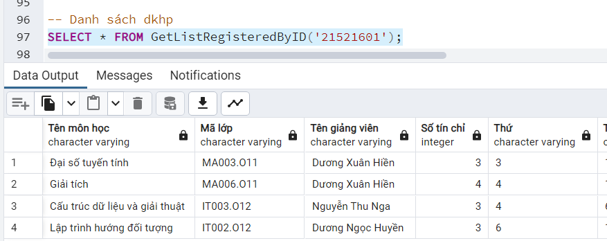

## RejectCourse

Môn bị reject sẽ bị xóa khỏi danh sách dkhp

```SQL
CREATE OR REPLACE FUNCTION RejectCourse(_idProfile VARCHAR(100), _idCourse VARCHAR(100))
RETURNS bool AS $$
DECLARE
    _idScore INT;
BEGIN
    SELECT INTO _idScore Score.id FROM Score, Schedule
    WHERE Schedule.idScore = Score.id
        AND Schedule.idProfile = _idProfile
        AND Schedule.idCourse = _idCourse;

	IF _idScore IS NULL THEN
        RETURN false;
    END IF;

    -- Check if any scores are not null
    IF EXISTS (
        SELECT 1
        FROM Score
        WHERE id = _idScore
            AND (processScore IS NOT NULL OR midtermScore IS NOT NULL OR finalScore IS NOT NULL OR practiceScore IS NOT NULL)
    ) THEN
        RETURN false;
    END IF;

    -- Delete from Schedule and Score tables
    DELETE FROM Schedule
    WHERE Schedule.idScore = _idScore;

    DELETE FROM Score
    WHERE id = _idScore;

	-- Khi bị reject, sẽ xóa môn đó khỏi danh sách đăng kí học phần
	DELETE FROM registercourse
	where idcourse = _idCourse
		AND idprofile = _idProfile;

    RETURN true;
END;
$$ LANGUAGE plpgsql;
```

_Danh sách dkhp_
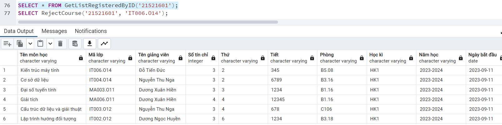

_Reject môn `IT006.O14`_
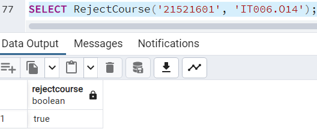

_Môn `IT006.O14` bị xóa khỏi danh sách đăng kí học phần_
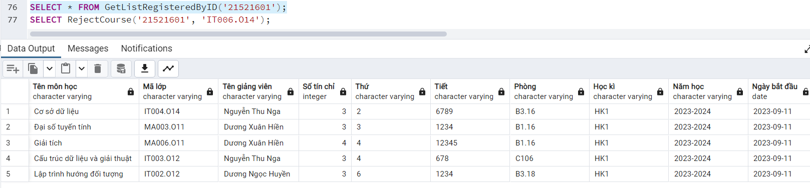

# Create

### getListCourse()

Lấy danh sách `mã môn học`, `tên môn học`

```SQL
create or replace function getListCourse()
returns table (
	"Mã lớp" varchar(100),
	"Tên môn học" varchar(100)
) as $$
begin
	return query
	select
		course.id as "Mã lớp",
		course.name as "Tên môn học"
	from course
	order by course.id;
end;
$$ LANGUAGE plpgsql;
```

_Example:_

```SQL
select * from getListCourse();
```

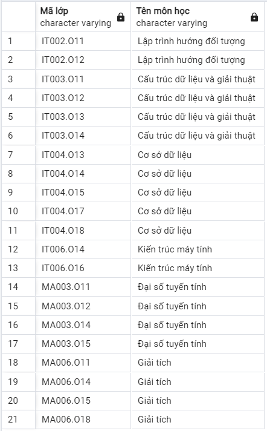

### getListProfilesByCourseId

Lấy danh sách `mssv/mgv` và `họ tên` theo `mã lớp`

```SQL
CREATE OR REPLACE FUNCTION getListProfilesByCourseId(_idCourse VARCHAR(100))
RETURNS TABLE (
    "MSSV/MGV" VARCHAR(100),
    "Họ tên" VARCHAR(100)
) AS $$
BEGIN
    RETURN QUERY
    SELECT profile.id AS "MSSV/MGV", profile.name AS "Họ tên"
    FROM profile, schedule
    WHERE schedule.idcourse = _idCourse
    AND schedule.idProfile = profile.id
    ORDER BY profile.id;
END;
$$ LANGUAGE plpgsql;
```

_Example:_

```SQL
select * from getListProfilesByCourseId('IT002.O11');
```

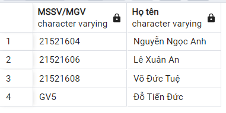
