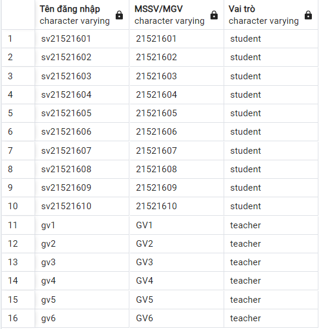
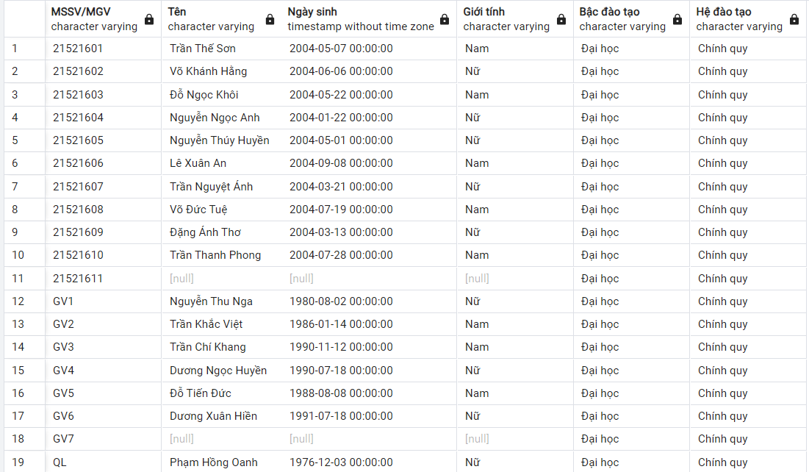
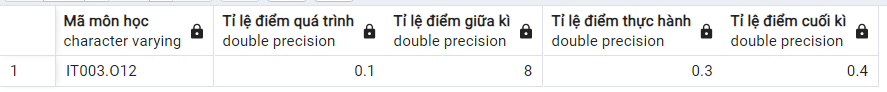

# Update

## InsertAcc

Insert thêm `role`

```SQL
CREATE OR REPLACE FUNCTION InsertAcc(
    IN v_username VARCHAR(100),
    IN v_password VARCHAR(1000),
	IN v_role varchar(100),
    IN v_id VARCHAR(100)
)
RETURNS Bool AS $$
BEGIN
    -- Check username exist

    IF (SELECT COUNT(*) FROM Account WHERE username = v_username) > 0 THEN
        RETURN false;
    END IF;

    -- Check id exist

    IF (SELECT COUNT(*) FROM Profile WHERE id = v_id) > 0 THEN
        RETURN false;
    END IF;

    INSERT INTO Account(username, password, role)
    VALUES (v_username, v_password, v_role);

    INSERT INTO Profile(id)
    VALUES (v_id);

    INSERT INTO UserAcc(idAccount, idProfile)
    VALUES (v_username, v_id);

    RETURN true;
END;
$$ LANGUAGE plpgsql;
```

_Example:_

```SQL
SELECT InsertAcc('student11', '$2a$12$2E8BpuvE2sfLPLfEnEe/bODy2s26qnyN4tKIpOHkULc1UVtVTrfZy', 'student', '21521611');
```

# Create

## getListAccounts

Lấy danh sách các tài khoản

```SQL
create or replace function getListAccounts()
returns table (
	"Tên đăng nhập" varchar(100),
	"MSSV/MGV" varchar(100),
	"Vai trò" varchar(100)
) as $$
begin
	return query
	select account.username as "Tên đăng nhập", useracc.idprofile as "MSSV/MGV", account.role as "Vai trò" from account, useracc
	where account.username = useracc.idaccount
	and account.role != 'admin'
	order by useracc.idprofile;
end;
$$ LANGUAGE plpgsql;
```

_Example:_

```SQL
select * from getListAccounts();
```



## GetListProfileInfo

Lấy danh sách thông tin profile của tất cả user

```SQL
CREATE OR REPLACE FUNCTION GetListProfileInfo()
RETURNS TABLE("MSSV/MGV" VARCHAR(100), "Tên" VARCHAR(100), "Ngày sinh" TIMESTAMP, "Giới tính" VARCHAR(100), "Bậc đào tạo" VARCHAR(100), "Hệ đào tạo" VARCHAR(100)) AS $$
BEGIN
    RETURN QUERY
    SELECT id as "MSSV/MGV",
           name as "Tên",
           birthday as "Ngày sinh",
           gender as "Giới tính",
           level as "Bậc đào tạo",
           trainingSystem as "Hệ đào tạo"
    FROM Profile
	order by id;
END;
$$ LANGUAGE plpgsql;
```

_Example:_

```SQL
SELECT * FROM GetListProfileInfo();
```



### getRaitoScoreByCourseId

-   Lấy tỉ lệ điểm của môn học theo mã môn học

```SQL
create or replace function getRaitoScoreByCourseId(_idCourse varchar(100))
returns table (
	"Mã môn học" varchar(100),
	"Tỉ lệ điểm quá trình" float,
	"Tỉ lệ điểm giữa kì" float,
	"Tỉ lệ điểm thực hành" float,
	"Tỉ lệ điểm cuối kì" float
) as $$
begin
	return query
	select
		schedule.idcourse as "Mã môn học",
		score.ratioprocess as "Tỉ lệ điểm quá trình",
		score.midtermscore as "Tỉ lệ điểm giữa kì",
		score.ratiopractice as "Tỉ lệ điểm thực hành",
		score.ratiofinal as "Tỉ lệ điểm cuối kì"
	from schedule, score
	where schedule.idscore = score.id
	and schedule.idcourse = _idCourse;
end;
$$ LANGUAGE plpgsql;
```

_Example:_

```SQL
select * from getRaitoScoreByCourseId('IT003.O12');
```


