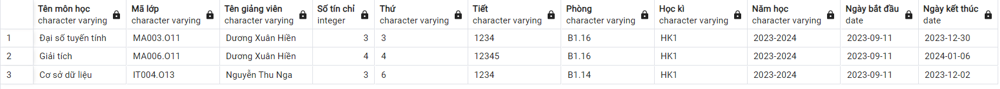
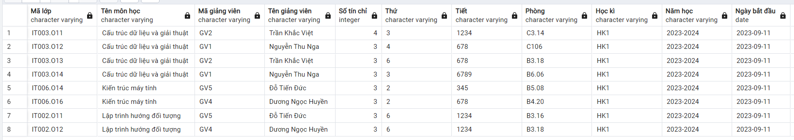
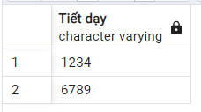
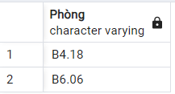

# Update

## updateRegisterCourse

Thêm:

-   Check trùng lịch dạy của gv
-   Check trùng lịch phòng

Chỉ được update `số tín chỉ`, `thứ`, `tiết`, `phòng`, `học kì`, `năm học`, `ngày bắt`, `ngày kết thúc`

```SQL
CREATE OR REPLACE FUNCTION updateRegisterCourse(
    IN courseId VARCHAR(100),
    IN profileId VARCHAR(100),
    IN courseNumberOfCredits INT,
    IN courseSchoolDay VARCHAR(100),
    IN courseLesson VARCHAR(100),
    IN courseClassroom VARCHAR(100),
    IN courseSemester VARCHAR(100),
    IN courseSchoolYear VARCHAR(100),
    IN courseStartDay TIMESTAMP,
    IN courseEndDay TIMESTAMP
)
RETURNS BOOLEAN AS $$
DECLARE
    lastEndTime TIMESTAMP;
    lastStartTime TIMESTAMP;
BEGIN
    SELECT starttime, endtime INTO lastStartTime, lastEndTime FROM RegistrationPeriod ORDER BY starttime DESC LIMIT 1;

    -- Không được sửa danh sách dkhp khi đăng mở đăng kí

    IF (lastStartTime <= CURRENT_TIMESTAMP) AND (lastEndTime > CURRENT_TIMESTAMP) THEN
        RETURN FALSE;
    END IF;

	-- 	Check trùng lịch dạy của gv
	if (select count(*) from
			(select "Thứ", "Tiết" from getschedulebyid(profileId)
			where "Mã môn học" != courseId
			and "Thứ" = courseSchoolDay
			and "Tiết"  LIKE '%' || courseLesson || '%')
	   ) > 0
	 then
	 	return false;
	 end if;


	-- check trùng lịch phòng
	if (
		select count(*) from
			(select * from course
			where course.schoolday = courseSchoolDay
			and course.lesson like '%' || courseLesson || '%'
			and course.classroom = courseClassroom)
	) > 0
	then
		return false;
	end if;

	if courseEndDay <= courseStartDay
	then return false;
	end if;


    UPDATE Course
    SET
        numberOfCredits = courseNumberOfCredits,
        schoolDay = courseSchoolDay,
        lesson = courseLesson,
        classroom = courseClassroom,
        semester = courseSemester,
        schoolYear = courseSchoolYear,
        startDay = courseStartDay,
        endDay = courseEndDay
    WHERE
        id = courseId;

    RETURN TRUE;
END;
$$ LANGUAGE plpgsql;
```

_Example:_

```SQL
SELECT updateregistercourse('IT003.O11', 'Cấu trúc dữ liệu và giải thuật 2', 'GV2', 'Trần Khắc Việt 2', 4, '3', '1234', 'C312', 'HK1', '2023-2024', '2023-09-11', '2024-01-06')
```

# Create

## GetUnregisteredListById

_Note: dùng hàm này để thay thế hàm `GetListRegisterCourse()` để xử lý UI dễ dàng hơn_

Lấy các môn chưa đăng kí học phần

```SQL
CREATE OR REPLACE FUNCTION GetUnregisteredListById(_profileId varchar(100))
RETURNS TABLE(
	"Mã lớp" VARCHAR(100),
    "Tên môn học" VARCHAR(100),
    "Mã giảng viên" VARCHAR(100),
    "Tên giảng viên" VARCHAR(100),
    "Số tín chỉ" INT,
    "Thứ" VARCHAR(100),
    "Tiết" VARCHAR(100),
    "Phòng" VARCHAR(100),
    "Học kì" VARCHAR(100),
    "Năm học" VARCHAR(100),
    "Ngày bắt đầu" DATE,
    "Ngày kết thúc" DATE
) AS $$
BEGIN
	return query
	select * from GetListRegisterCourse() as lrc
	where substring(lrc."Mã lớp" from 1 for position('.' in lrc."Mã lớp")-1)
		not in
			(select substring(lr."Mã lớp" from 1 for position('.' in lr."Mã lớp")-1) FROM GetListRegisteredByID(_profileId) as lr);
END;
$$ LANGUAGE plpgsql;
```

_Example:_

```SQL
select * from GetUnregisteredListById('21521602');
```

Các môn đã đăng kí học phần



Các môn chưa đăng kí sẽ không bao gồm các môn đã đăng kí _(dù khác mã lớp nhưng cùng 1 môn cũng sẽ không được bao gồm)_



## getLessonsOnDay

Lấy danh sách các tiết dạy của giảng viên vào thứ `_schoolday`

```SQL
create or replace function getLessonsOnDay(_profileId varchar(100), _schoolday varchar(100))
returns table(
	"Tiết dạy" varchar(100)
) as $$
begin
	return query
	select "Tiết" as "Tiết dạy" from GetScheduleByID(_profileId)
	where "Thứ" = _schoolday;
end;
$$ LANGUAGE plpgsql;
```

_Example:_

```SQL
select * from getLessonsOnDay('GV1', '3');
```



### getLessonsOnDay

Lấy danh sách các phòng đang dùng vào thứ `_schoolday`, tiết `_lesson`

```SQL
CREATE OR REPLACE FUNCTION getListClassroomOnDay(_schoolday VARCHAR(100), _lesson VARCHAR(100))
RETURNS TABLE (
    "Phòng" VARCHAR(100)
) AS $$
BEGIN
    RETURN QUERY
    SELECT classroom AS "Phòng" FROM course
    WHERE schoolday = _schoolday AND lesson = _lesson;
END;
$$ LANGUAGE plpgsql;
```

```SQL
select * from getListClassroomOnDay('3', '6789');
```


